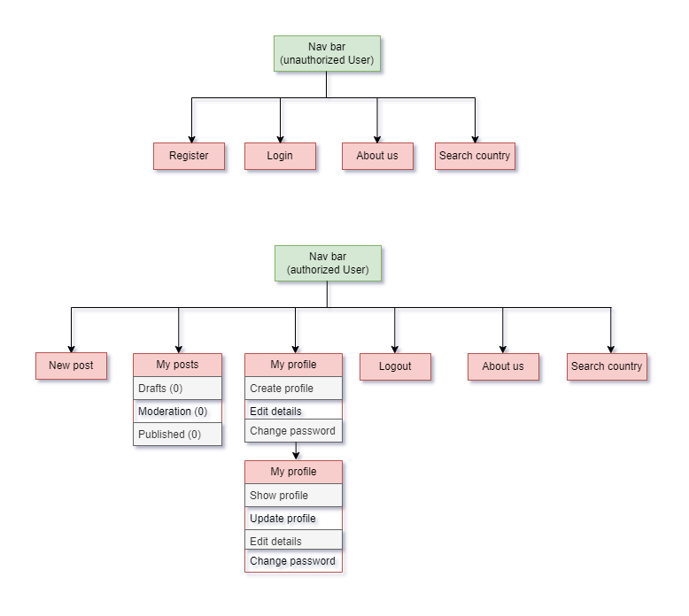
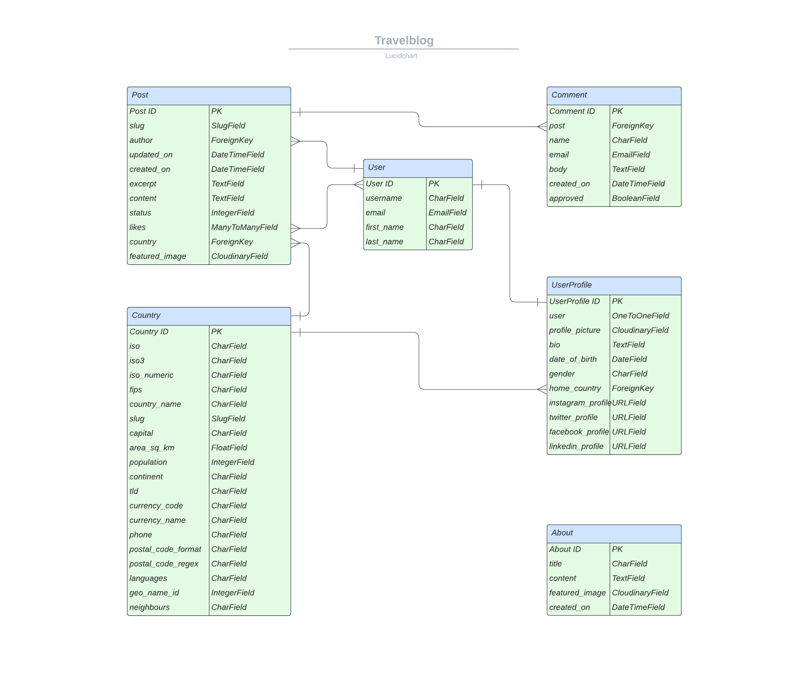
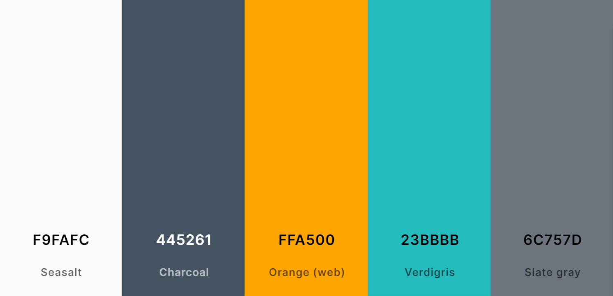

# Travel blog

Welcome to our vibrant travel community! At our travel blog, we strive to create
a
space where passionate globetrotters can come together, share their adventures,
and
find inspiration for their next journey.

Whether you're an avid explorer or an armchair traveler, our platform offers an
array
of captivating travel narratives, insightful comments, and a seamless
user-friendly
interface.

Explore fascinating travelogues, leave your thoughts, and unearth comprehensive
country
details effortlessly through our convenient search feature. Join us in
celebrating the
joy of exploration and discovery!

## Table of Contents

1. [User Experience (UX)](#user-experience-ux)
    1. [Project Goals](#project-goals)
    2. [User Stories](#user-stories)
    3. [General structure](#general-structure)
    4. [Database Models](#database-models)
    5. [Color Scheme](#color-scheme)
    6. [Topography](#topography)

## User Experience (UX)

### Project Goals:

The project aims to achieve a set of well-defined goals, each falling under one
of the four primary epics. These epics, namely Admin Management, Post
Management, Search and Filtering, and User Management, represent distinct
aspects of the travel blog application. Each section within the project goals is
designed to address specific requirements related to these epics, ensuring a
cohesive and efficient implementation of the application.

#### Admin Management:

- Implement a comprehensive user management control system, including user
  registration, profile creation and management, secure login and logout
  mechanism, and password change feature.
- Provide efficient blog content management for administrators, enabling post
  creation, editing, and deletion, as well as content moderation.
- Enable the management of country and user comments within the admin panel for
  enhanced control and organization.
- Implement a user-friendly interface for managing the 'About Us' page
  within the admin panel.

#### Post Management:

- Enable users to open and read blog posts seamlessly, focusing on user
  experience.
- Display comprehensive 'About Us' information on the website for users.
- Implement a paginated list of posts for a streamlined browsing experience.
- Provide the functionality to create new blog posts easily and efficiently.
- Allow the editing and deletion of posts by authorized users for better
  content management.
- Enable users to like and comment on posts, fostering engagement and
  interaction.

#### Search and Filtering:

- Provide a country information search feature to enable users to find
  relevant information quickly.
- Categorize posts by the author's name and location to facilitate efficient
  searching and filtering.

#### User Management:

- Ensure a robust account registration functionality for new users to sign up
  easily.
- Implement a secure login and logout mechanism to protect user accounts and
  data.
- Allow users to change their passwords conveniently for security purposes.
- Provide comprehensive user profile creation and management capabilities for a
  personalized user experience.
- Enable users to view their profiles and manage them as needed.

### User stories:

Prior to commencing the project, a comprehensive compilation of 19 user stories
was developed to cater to the requirements of both the Admin and the User,
effectively addressing their expectations for the travel blog site. Based on the
project's structure and the significance of each user story, they were organized
in a sequence that is presented in the project development strategy table.

| No | Title                                    | User Story                                                                                                                                                                                                                                 | Epic                 | Tag         |
|----|------------------------------------------|--------------------------------------------------------------------------------------------------------------------------------------------------------------------------------------------------------------------------------------------|----------------------|-------------|
| 1  | Paginated List of Posts                  | As a user I can view a paginated list of posts so that I can easily find and access various blog entries                                                                                                                                   | Post Management      | MUST HAVE   |
| 2  | Content Moderation for Admin             | As a site Admin I can monitor and manage user-generated content so that maintain a safe and high-quality platform                                                                                                                          | Admin Management     | MUST HAVE   |
| 3  | Blog Content Management for Admin        | As a site admin I can create, read, update, make drafts and delete posts using admin panel so that I can manage my own blog content                                                                                                        | Admin Management     | MUST HAVE   |
| 4  | Country and Comment Management for Admin | As a site admin I can manage countries and comments within the platform so that I could oversee user interactions and ensure a safe and engaging community environment                                                                     | Admin Management     | MUST HAVE   |
| 5  | Create New Blog Posts                    | As a user I can create new blog posts with text and images so that I can share my experiences and insights with others                                                                                                                     | Post Management      | MUST HAVE   |
| 6  | Open and Read a Post                     | As a user I can open and read a post so that I could delve into the content and explore its details                                                                                                                                        | Post Management      | MUST HAVE   |
| 7  | Edit and Delete Posts                    | As a user I can edit and delete my own posts so that I have control over the content I publish and can keep it up to date                                                                                                                  | Post Management      | MUST HAVE   |
| 8  | Account Registration Functionality       | As a user I can register and create account so that I can access exclusive features and personalized content                                                                                                                               | User Management      | MUST HAVE   |
| 9  | User Management Controls                 | As a site Admin I can manage user accounts so that I could ensure platform integrity and user compliance                                                                                                                                   | Admin Management     | MUST HAVE   |
| 10 | Secure Login and Logout Mechanism        | As a user I can log in and log out securely so that so that my account remain protected and accessible only by me                                                                                                                          | User Management      | MUST HAVE   |
| 11 | User Profile Creation and Management     | As a user I can create, update and personalize my profile after registration so that I can share my preferences and information with the community in a customized manner                                                                  | User Management      | MUST HAVE   |
| 12 | User Profile Viewing Capability          | As a user I can see other users' profiles so that I can connect and engage with other members of the community, fostering collaboration and interaction                                                                                    | User Management      | SHOULD HAVE |
| 13 | Password Change Feature                  | As a user I can change password so that I can maintain the security of my account and information.                                                                                                                                         | User Management      | SHOULD HAVE |
| 14 | Categorize Posts by Location             | As a user I can utilize a system for categorizing and filtering posts by country so that I can easily navigate and explore content related to specific locations                                                                           | Search and Filtering | SHOULD HAVE |
| 15 | Country Information Search Feature       | As a user I can quickly search and access brief information about a specific country so that I can gather essential details without extensive navigation or research                                                                       | Search and Filtering | SHOULD HAVE |
| 16 | Display About Us Information             | As a user I can view the About Us page so that I can stay informed about the mission, and understand the platform's purpose and offerings                                                                                                  | Post Management      | MUST HAVE   |
| 17 | Manage About Us Page in the Admin Panel  | As a site admin I can I can manage and update the About Us page through an intuitive interface within the Django admin panel so that the travelblog mission, purpose, and latest information are accurately presented to the site visitors | Admin Management     | MUST HAVE   |
| 18 | Like and Comment on Posts                | As a user I can like and comment on blog posts so that I can engage with the community, express my thoughts, and show appreciation for interesting content                                                                                 | Post Management      | SHOULD HAVE |
| 19 | Categorize Posts by Author's Name        | As a user I can utilize a system for categorizing and filtering posts by author's name so that I can easily navigate and explore content related to specific author                                                                        | Search and Filtering | WON'T HAVE  |

### General structure:

The key component of the site is the navbar, which is structured to enable users
to access any section of the site with minimal number of clicks. This ensures a
seamless and intuitive navigation experience for the site's users.

* The header, footer, and navigation bar maintain consistency across all pages.
* Each separate post and postcard on paginated list of posts contains links to
  the author and country pages, providing clear feedback for the user.
* The home page presents a paginated list of posts, along with a filter for
  selecting posts by country. Additionally, it provides information about the
  total number of filtered or unfiltered posts.
* Upon registering an account and creating their profile, users can add extra
  content to the site.

### Database models:

The database models have been designed using [Lucidchart](https://lucid.app/).
In this chart, only a few of the most important fields from the inherited
Django User model are displayed. For a complete description of the User model's
fields, please refer to the information provided below.
For the purpose of this project relational database
[ElephantSQL](https://www.elephantsql.com/) was used.

#### Inherited Django User Model:

- **Username:** This is the user's unique username and is used for
  identification purposes.
- **Email:** It represents the user's email address, which is also unique and is
  frequently used for authentication and communication.
- **Password:** It stores the user's password, which is secured and encrypted in
  the database.
- **First Name and Last Name:** These fields store the user's first name and
  last name, respectively.
- **Date Joined:** This field records the date when the user joined the platform
  or when their account was created.
- **Is Active:** This Boolean field indicates whether the user's account is
  active or not. If it is set to True, the account is active; otherwise, it is
  not active.
- **Is Staff:** This Boolean field indicates whether the user is a staff member
  or not. Staff members typically have additional permissions.
- **Is Superuser:** This Boolean field identifies whether the user has
  administrative privileges. Superusers have all permissions and access to all
  functionalities within the Django project.
- **Last Login:** This field records the last time the user logged into the
  system.

#### Post model:

- **Title:** This field stores a unique title for each post provided by the
  author.
- **Slug:** The unique slug field is used to identify the post.
- **Author:** This field represents the author of the post and is linked to the
  User model.
- **Updated On:** The date and time are automatically set every time the post is
  updated.
- **Content:** This field stores the content of the post as provided by the
  author.
- **Status:** It is an integer field that stores the status of the post,
  selected from predefined choices.
- **Featured Image:** This field is used to store the image related to the post,
  using CloudinaryField.
- **Excerpt:** It stores a brief excerpt related to the post, and it can be left
  blank.
- **Created On:** The date and time are set automatically at the post's
  creation.
- **Likes:** This field represents the many-to-many relationship between users
  and posts, allowing users to like posts.
- **Country:** This field represents the foreign key linking the post to a
  specific country in the Country model.

#### Country Model:

- **ISO, ISO3, ISO Numeric, FIPS:** These fields store specific codes associated
  with the country.
- **Country Name:** This unique field stores the name of the country.
- **Slug:** A unique slug is assigned to each country to identify it.
- **Capital:** It holds the name of the capital city of the country.
- **Area in Square Kilometers:** This field stores the area of the country in
  square kilometers.
- **Population:** It represents the population count of the country.
- **Continent:** This field stores the name of the continent where the country
  is located.
- **TLD:** It holds the top-level domain code associated with the country.
- **Currency Code and Name:** These fields store the code and name of the
  currency used in the country.
- **Phone:** It stores the phone code of the country.
- **Postal Code Format and Regex:** These fields represent the format and
  regular expression associated with the postal code of the country.
- **Languages:** This field stores the languages spoken in the country.
- **Geo Name ID:** It stores the unique Geo Name ID assigned to the country.
- **Neighbours:** This field is dedicated to storing the names of neighboring
  countries.

#### Comment model:

- **Post:** This field serves as a foreign key, linking the comments to the
  related post, ensuring that when a post is deleted, the associated comments
  are deleted as well.
- **Name:** It stores the name of the commenter, with a maximum length of 80
  characters.
- **Email:** This field stores the email address of the commenter.
- **Body:** It stores the actual text content of the comment.
- **Created On:** This field automatically stores the date and time when the
  comment was created.
- **Approved:** It is a boolean field that indicates whether the comment has
  been approved or not. If approved, the value is set to True; otherwise, it is
  set to False.

#### UserProfile Model

- **User:** This field serves as a one-to-one relationship with the User model,
  ensuring that each user has a single profile. If a user is deleted, their
  associated profile is deleted as well.
- **Profile Picture:** This field is used to store the image of the user
  profile, utilizing the Cloudinary service. If no image is provided, a
  placeholder image is used as the default.
- **Bio:** It stores the biography of the user, allowing for a longer text
  input.
- **Date of Birth:** This field stores the date of birth of the user. It allows
  blank values and null values to be set.
- **Gender:** It provides a selection for the gender of the user, with choices
  including 'Male,' 'Female,' and 'Other.'
- **Home Country:** This field serves as a foreign key to the Country model,
  indicating the home country of the user.
- **Instagram Profile, Twitter Profile, Facebook Profile, LinkedIn Profile:**
  These fields store the URLs of the user's social media profiles, allowing the
  user to provide links to their social media accounts.

#### About Model

- **Title:** This field allows for a maximum of 200 characters for the title,
  with the option for it to be left blank.
- **Content:** It is a field that stores the detailed content or information for
  the 'About' section. The text can be as long as needed.
- **Featured Image:** This field utilizes Cloudinary to store the image for
  the 'About' section. If no image is provided, a placeholder image is used as
  the default.
- **Created On:** This field stores the date and time when the 'About' content
  was created. By default, it takes the current time as the creation time.

### Color scheme:

The color scheme palette for the project was created using the
[Colors](https://coolors.co/), which involved the selection of complementary and
contrasting colors.

**Primary colors palette**

**The colors used in the website are as follows:**

- background color for all pages: #F9FAFC
- background color for the nav bar and the footer: #445261
- logo colors: #FFA500 and #23BBBB
- post card colors: #23BBBB and #445261
- button colors: #6C757D and #198754
- text-colors: #FFFFFF, #23BBBB, #212529 and #198754
- hover-text colors: #6C757D, #FFFFFF, #BA2323, #125D5D

The color scheme was selected to strike a balance between a contemporary design
and a simple, user-friendly interface, ensuring that the content remains the
focal point while also delivering an attractive layout for users.

### Topography

 - The main font used on the site is Roboto, with a sans-serif font as a 
 fallback in case the main font is not imported correctly.
 - Lato was used for the logo design.
