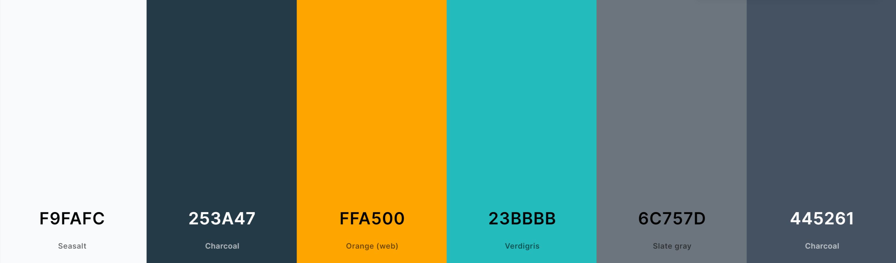
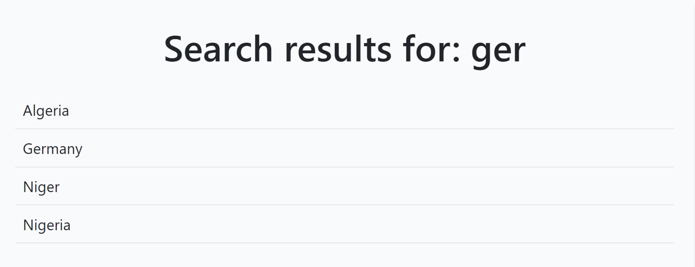

# Travel blog

Welcome to our vibrant travel community! At our travel blog, we strive to create
a
space where passionate globetrotters can come together, share their adventures,
and
find inspiration for their next journey.

Whether you're an avid explorer or an armchair traveler, our platform offers an
array
of captivating travel narratives, insightful comments, and a seamless
user-friendly
interface.

Explore fascinating travelogues, leave your thoughts, and unearth comprehensive
country
details effortlessly through our convenient search feature. Join us in
celebrating the
joy of exploration and discovery!

## Table of Contents

1. [User Experience (UX)](#user-experience-ux)
    1. [Project Goals](#project-goals)
    2. [User Stories](#user-stories)
    3. [General structure](#general-structure)
    4. [Database Models](#database-models)
    5. [Color Scheme](#color-scheme)
    6. [Topography](#topography)
2. [Features](#features)
    1. [General](#general)
    2. [Navigation Bar & Footer](#navigation-bar--footer)
    3. [Home Page](#home-page)
    4. [Post Details Page](#post-details-page)
    5. [Create Post Page](#create-post-page)
    6. [Update Post Page](#update-post-page)
    7. [Delete Post Page](#delete-post-page)
    8. [Show Country Page](#show-country-page)
    9. [Author bio page](#author-bio-page)
    10. [Authentication Pages](#authentication-pages)
    11. [Edit Details Page](#edit-details-page)
    12. [Change Password Page](#change-password-page)
    13. [Create User Profile Page](#create-user-profile-page)
    14. [Update User Profile Page](#general)
    15. [About Page](#general)
3. [Technologies Used](#technologies-used)
    1. [Languages Used](#languages-used)
    2. [Libraries and Frameworks](#libraries-and-frameworks)
    3. [Packages Installed](#packages-installed)
    4. [Database Management](#database-management)
    5. [Tools and Programs](#tools-and-programs)
4. [Testing](#testing)
    1. [Go to TESTING.md]()
5. [Virtual environment](#virtual-environment)

## User Experience (UX)

### Project Goals:

The project aims to achieve a set of well-defined goals, each falling under one
of the four primary epics. These epics, namely Admin Management, Post
Management, Search and Filtering, and User Management, represent distinct
aspects of the travel blog application. Each section within the project goals is
designed to address specific requirements related to these epics, ensuring a
cohesive and efficient implementation of the application.
[Back to top ⇧](#table-of-contents)

#### Admin Management:

- Implement a comprehensive user management control system, including user
  registration, profile creation and management, secure login and logout
  mechanism, and password change feature.
- Provide efficient blog content management for administrators, enabling post
  creation, editing, and deletion, as well as content moderation.
- Enable the management of country and user comments within the admin panel for
  enhanced control and organization.
- Implement a user-friendly interface for managing the 'About Us' page
  within the admin panel.
  [Back to top ⇧](#table-of-contents)

#### Post Management:

- Enable users to open and read blog posts seamlessly, focusing on user
  experience.
- Display comprehensive 'About Us' information on the website for users.
- Implement a paginated list of posts for a streamlined browsing experience.
- Provide the functionality to create new blog posts easily and efficiently.
- Allow the editing and deletion of posts by authorized users for better
  content management.
- Enable users to like and comment on posts, fostering engagement and
  interaction.
  [Back to top ⇧](#table-of-contents)

#### Search and Filtering:

- Provide a country information search feature to enable users to find
  relevant information quickly.
- Categorize posts by the author's name and location to facilitate efficient
  searching and filtering.
  [Back to top ⇧](#table-of-contents)

#### User Management:

- Ensure a robust account registration functionality for new users to sign up
  easily.
- Implement a secure login and logout mechanism to protect user accounts and
  data.
- Allow users to change their passwords conveniently for security purposes.
- Provide comprehensive user profile creation and management capabilities for a
  personalized user experience.
- Enable users to view their profiles and manage them as needed.
  [Back to top ⇧](#table-of-contents)

### User stories:

Prior to commencing the project, a comprehensive compilation of 19 user stories
was developed to cater to the requirements of both the Admin and the User,
effectively addressing their expectations for the travel blog site. Based on the
project's structure and the significance of each user story, they were organized
in a sequence that is presented in the project development strategy table.

| No | Title                                    | User Story                                                                                                                                                                                                                                 | Epic                 | Tag         |
|----|------------------------------------------|--------------------------------------------------------------------------------------------------------------------------------------------------------------------------------------------------------------------------------------------|----------------------|-------------|
| 1  | Paginated List of Posts                  | As a user I can view a paginated list of posts so that I can easily find and access various blog entries                                                                                                                                   | Post Management      | MUST HAVE   |
| 2  | Content Moderation for Admin             | As a site Admin I can monitor and manage user-generated content so that maintain a safe and high-quality platform                                                                                                                          | Admin Management     | MUST HAVE   |
| 3  | Blog Content Management for Admin        | As a site admin I can create, read, update, make drafts and delete posts using admin panel so that I can manage my own blog content                                                                                                        | Admin Management     | MUST HAVE   |
| 4  | Country and Comment Management for Admin | As a site admin I can manage countries and comments within the platform so that I could oversee user interactions and ensure a safe and engaging community environment                                                                     | Admin Management     | MUST HAVE   |
| 5  | Create New Blog Posts                    | As a user I can create new blog posts with text and images so that I can share my experiences and insights with others                                                                                                                     | Post Management      | MUST HAVE   |
| 6  | Open and Read a Post                     | As a user I can open and read a post so that I could delve into the content and explore its details                                                                                                                                        | Post Management      | MUST HAVE   |
| 7  | Edit and Delete Posts                    | As a user I can edit and delete my own posts so that I have control over the content I publish and can keep it up to date                                                                                                                  | Post Management      | MUST HAVE   |
| 8  | Account Registration Functionality       | As a user I can register and create account so that I can access exclusive features and personalized content                                                                                                                               | User Management      | MUST HAVE   |
| 9  | User Management Controls                 | As a site Admin I can manage user accounts so that I could ensure platform integrity and user compliance                                                                                                                                   | Admin Management     | MUST HAVE   |
| 10 | Secure Login and Logout Mechanism        | As a user I can log in and log out securely so that so that my account remain protected and accessible only by me                                                                                                                          | User Management      | MUST HAVE   |
| 11 | User Profile Creation and Management     | As a user I can create, update and personalize my profile after registration so that I can share my preferences and information with the community in a customized manner                                                                  | User Management      | MUST HAVE   |
| 12 | User Profile Viewing Capability          | As a user I can see other users' profiles so that I can connect and engage with other members of the community, fostering collaboration and interaction                                                                                    | User Management      | SHOULD HAVE |
| 13 | Password Change Feature                  | As a user I can change password so that I can maintain the security of my account and information.                                                                                                                                         | User Management      | SHOULD HAVE |
| 14 | Categorize Posts by Location             | As a user I can utilize a system for categorizing and filtering posts by country so that I can easily navigate and explore content related to specific locations                                                                           | Search and Filtering | SHOULD HAVE |
| 15 | Country Information Search Feature       | As a user I can quickly search and access brief information about a specific country so that I can gather essential details without extensive navigation or research                                                                       | Search and Filtering | SHOULD HAVE |
| 16 | Display About Us Information             | As a user I can view the About Us page so that I can stay informed about the mission, and understand the platform's purpose and offerings                                                                                                  | Post Management      | MUST HAVE   |
| 17 | Manage About Us Page in the Admin Panel  | As a site admin I can I can manage and update the About Us page through an intuitive interface within the Django admin panel so that the TravelBlog mission, purpose, and latest information are accurately presented to the site visitors | Admin Management     | MUST HAVE   |
| 18 | Like and Comment on Posts                | As a user I can like and comment on blog posts so that I can engage with the community, express my thoughts, and show appreciation for interesting content                                                                                 | Post Management      | SHOULD HAVE |
| 19 | Categorize Posts by Author's Name        | As a user I can utilize a system for categorizing and filtering posts by author's name so that I can easily navigate and explore content related to specific author                                                                        | Search and Filtering | WON'T HAVE  |

[Back to top ⇧](#table-of-contents)

### General structure:

The key component of the site is the navbar, which is structured to enable users
to access any section of the site with minimal number of clicks. This ensures a
seamless and intuitive navigation experience for the site's users.

* The header, footer, and navigation bar maintain consistency across all pages.
* Upon registering an account and creating their profile, users can add extra
  content to the site.
  [Back to top ⇧](#table-of-contents)

### Database models:

The database models have been designed using [Lucidchart](https://lucid.app/).
In this chart, only a few of the most important fields from the inherited
Django User model are displayed. For a complete description of the User model's
fields, please refer to the information provided below.
For the purpose of this project relational database
[ElephantSQL](https://www.elephantsql.com/) was used.

#### Inherited Django User Model:

- **Username:** This is the user's unique username and is used for
  identification purposes.
- **Email:** It represents the user's email address, which is also unique and is
  frequently used for authentication and communication.
- **Password:** It stores the user's password, which is secured and encrypted in
  the database.
- **First Name and Last Name:** These fields store the user's first name and
  last name, respectively.
- **Date Joined:** This field records the date when the user joined the platform
  or when their account was created.
- **Is Active:** This Boolean field indicates whether the user's account is
  active or not. If it is set to True, the account is active; otherwise, it is
  not active.
- **Is Staff:** This Boolean field indicates whether the user is a staff member
  or not. Staff members typically have additional permissions.
- **Is Superuser:** This Boolean field identifies whether the user has
  administrative privileges. Superusers have all permissions and access to all
  functionalities within the Django project.
- **Last Login:** This field records the last time the user logged into the
  system.

#### Post model:

- **Title:** This field stores a unique title for each post provided by the
  author.
- **Slug:** The unique slug field is used to identify the post.
- **Author:** This field represents the author of the post and is linked to the
  User model.
- **Updated On:** The date and time are automatically set every time the post is
  updated.
- **Content:** This field stores the content of the post as provided by the
  author.
- **Status:** It is an integer field that stores the status of the post,
  selected from predefined choices.
- **Featured Image:** This field is used to store the image related to the post,
  using CloudinaryField.
- **Excerpt:** It stores a brief excerpt related to the post, and it can be left
  blank.
- **Created On:** The date and time are set automatically at the post's
  creation.
- **Likes:** This field represents the many-to-many relationship between users
  and posts, allowing users to like posts.
- **Country:** This field represents the foreign key linking the post to a
  specific country in the Country model.

#### Country Model:

- **ISO, ISO3, ISO Numeric, FIPS:** These fields store specific codes associated
  with the country.
- **Country Name:** This unique field stores the name of the country.
- **Slug:** A unique slug is assigned to each country to identify it.
- **Capital:** It holds the name of the capital city of the country.
- **Area in Square Kilometers:** This field stores the area of the country in
  square kilometers.
- **Population:** It represents the population count of the country.
- **Continent:** This field stores the name of the continent where the country
  is located.
- **TLD:** It holds the top-level domain code associated with the country.
- **Currency Code and Name:** These fields store the code and name of the
  currency used in the country.
- **Phone:** It stores the phone code of the country.
- **Postal Code Format and Regex:** These fields represent the format and
  regular expression associated with the postal code of the country.
- **Languages:** This field stores the languages spoken in the country.
- **Geo Name ID:** It stores the unique Geo Name ID assigned to the country.
- **Neighbours:** This field is dedicated to storing the names of neighboring
  countries.

#### Comment model:

- **Post:** This field serves as a foreign key, linking the comments to the
  related post, ensuring that when a post is deleted, the associated comments
  are deleted as well.
- **Name:** It stores the name of the commenter, with a maximum length of 80
  characters.
- **Email:** This field stores the email address of the commenter.
- **Body:** It stores the actual text content of the comment.
- **Created On:** This field automatically stores the date and time when the
  comment was created.
- **Approved:** It is a boolean field that indicates whether the comment has
  been approved or not. If approved, the value is set to True; otherwise, it is
  set to False.

#### UserProfile Model

- **User:** This field serves as a one-to-one relationship with the User model,
  ensuring that each user has a single profile. If a user is deleted, their
  associated profile is deleted as well.
- **Profile Picture:** This field is used to store the image of the user
  profile, utilizing the Cloudinary service. If no image is provided, a
  placeholder image is used as the default.
- **Bio:** It stores the biography of the user, allowing for a longer text
  input.
- **Date of Birth:** This field stores the date of birth of the user. It allows
  blank values and null values to be set.
- **Gender:** It provides a selection for the gender of the user, with choices
  including 'Male,' 'Female,' and 'Other.'
- **Home Country:** This field serves as a foreign key to the Country model,
  indicating the home country of the user.
- **Instagram Profile, Twitter Profile, Facebook Profile, LinkedIn Profile:**
  These fields store the URLs of the user's social media profiles, allowing the
  user to provide links to their social media accounts.

#### About Model

- **Title:** This field allows for a maximum of 200 characters for the title,
  with the option for it to be left blank.
- **Content:** It is a field that stores the detailed content or information for
  the 'About' section. The text can be as long as needed.
- **Featured Image:** This field utilizes Cloudinary to store the image for
  the 'About' section. If no image is provided, a placeholder image is used as
  the default.
- **Created On:** This field stores the date and time when the 'About' content
  was created. By default, it takes the current time as the creation time.
  [Back to top ⇧](#table-of-contents)

### Color scheme:

The color scheme palette for the project was created using the
[Colors](https://coolors.co/), which involved the selection of complementary and
contrasting colors.

**Primary colors palette**

**The colors used in the website are as follows:**

- background color for all pages: #F9FAFC
- background color for the nav bar and the footer: #445261
- logo colors: #FFA500 and #23BBBB
- post card colors: #23BBBB and #445261
- button colors: #6C757D and #198754
- text-colors: #FFFFFF, #23BBBB, #212529 and #198754
- hover-text colors: #6C757D, #FFFFFF, #BA2323, #125D5D

The color scheme was selected to strike a balance between a contemporary design
and a simple, user-friendly interface, ensuring that the content remains the
focal point while also delivering an attractive layout for users.
[Back to top ⇧](#table-of-contents)

### Topography:

- The main font used on the site is Roboto, with a sans-serif font as a
  fallback in case the main font is not imported correctly.
- Lato was used for the logo design.
  [Back to top ⇧](#table-of-contents)

## Features.

### General:

* The website was built with a mobile-centric approach.
* The website was developed to ensure optimal performance across various
  devices, including mobile phones, tablets, etc.
  [Back to top ⇧](#table-of-contents)

### Navigation Bar & Footer:

* Includes the main logo, colored greeting and section links.
* Logo image is linked to the [home page](#home-page).
* The navigation bar features links to all sections, enhancing ease of
  navigation throughout the site. Additionally, it incorporates a hover effect
  that changes color, providing users with visual feedback for an improved
  browsing experience.

**Depending on the user status, nav bar has two different state:**

1. Unauthorized user:
   
2. Authorized user:
   

* The 'My Profile' dropdown menu toggles between 'Create Profile' and 'Show
  Profile'/'Edit Profile' choices based on whether the user has created their
  profile or not.
* The 'My Posts' dropdown menu provides three options: 'Drafts', 'Awaiting
  Moderation', and 'Published', allowing authorised post authors to view their
  paginated list of posts for each corresponding status.
* The search country info window enables users to easily access country
  profiles.
  
* If the user clicks on the search bar without entering any text, a
  comprehensive list of all countries is displayed. Otherwise, a list of
  countries containing the user's search query in any part of the country name
  is generated. All countries in the list are arranged in alphabetical order.
  Each country in the list is linked to its profile. The search query is not
  case-sensitive.

* The footer includes the TravelBlog trademark, which is linked to the main
  page, and links to various social media channels.
  
  [Back to top ⇧](#table-of-contents)

### Home Page:

* The home page presents a paginated list of posts, with 3 posts displayed per
  page, and includes a filter for selecting posts by country.
* The home page also provides information about the total number of posts,
  that are filtered and unfiltered.
* To improve user experience, all post titles are truncated if they exceed 30
  characters, and post excerpts are truncated if they exceed 40 characters.
* Each post card on the paginated list of posts contains links to the
  [author bio page](#author-bio-page) and
  the [show country page](#show-country-page),
  along with the date when the post was created and the total number of likes.
  This provides clear feedback for the user.

  
  [Back to top ⇧](#table-of-contents)

### Post Details Page:

* Clicking on a post title or excerpt on the paginated list of posts redirects
  the user to the post details page.
* To improve the user experience, all post titles are truncated if they exceed
  25 characters.
* To maintain the author's writing style, the original title and excerpts are
  presented before the post content.
* At the end of the content, there is a comment section where other users'
  comments and post likes can be found. If you are not the post author, you can
  also like the post or leave a comment, provided that you have created your
  user profile.
* For better user experience, each comment contains the user's name, which is
  linked to their profile page, and the date the comment was created.
  
* Two buttons are available at the end of the post content for the authorized
  post author, enabling them to edit or delete the post.
* The post author is unable to like their own posts or leave a comment on them.
  
  [Back to top ⇧](#table-of-contents)

### Create Post Page:

* An authorized user with a user profile can create their own posts by clicking
  on the 'Create post' button on the [navigation bar](#navigation-bar--footer).
* The 'Create post' page contains various fields such as 'Country' (a dropdown
  list of all countries previously uploaded to the database), 'Title' (which
  should be unique), 'Post main image' (with a default post image option
  available), 'Excerpt', 'Content' (featuring the embedded Summernote WYSIWYG
  Editor), and a dropdown 'Status' list to save the post as Draft for future
  editing or send it for Moderation.
  
* If the user doesn't have a profile, they are kindly asked to create one if
  they wish to have the ability to publish their posts or comments.
  
  [Back to top ⇧](#table-of-contents)

### Update Post Page:

* Authors can update their posts at any time regardless of their status ('
  Draft', 'Awaiting approval', or 'Published').
* All updated posts must be approved by the Admin before they are published.
  
  [Back to top ⇧](#table-of-contents)

### Delete Post Page:

* Authors can also delete their posts at any time, regardless of their status ('
  Draft', 'Awaiting approval', or 'Published').
* Before deleting the post, the user is asked to confirm this action since
  this action can not be undone.
  
  [Back to top ⇧](#table-of-contents)

### Show Country Page:

* The user can access this page through three different links: via the
* [home page](#home-page), the [post details page](#post-details-page), and the
  search country result page.
* This page includes a brief country description, the country's flag, an
  interactive Google map, and a Wikipedia link.
  
  [Back to top ⇧](#table-of-contents)

### Author bio page:

* Users can access this page via two different links: through the
  [home page](#home-page) and through the
  [post details](#post-details-page) page.
* The page displays the user's uploaded image (with three default images
  available for different genders), the user's name, a short user bio, and other
  data from the user's profile.
* At the bottom of this page, you can find all the user's published posts,
  each linked to its corresponding [post details](#post-details-page) page.
  
  [Back to top ⇧](#table-of-contents)

### Authentication Pages:

* To enhance the user experience and reduce the number of required clicks, it
  was determined not to prompt for confirmation when the user chooses to log
  out.

| Page     | Description                                                    | Screenshot                                                        |
|----------|----------------------------------------------------------------|-------------------------------------------------------------------|
| Register | Allows the site user to sign up for an account on the website. |  |
| Login    | Allows the Site User to sign in with their account.            |     |

[Back to top ⇧](#table-of-contents)

### Edit Details Page:

* Enables the user to modify their first name, last name, and email.
* After creation, the user is unable to change their username.
  
  [Back to top ⇧](#table-of-contents)

### Change Password Page:

* Enables the user to change their password, requiring them to provide their old
  password for confirmation before proceeding.
  
  [Back to top ⇧](#table-of-contents)

### Create User Profile Page:

* To add additional content to the site, users are required to create a user
  profile upon registration.
* The form includes various fields such as 'Image' for uploading a user's
  image (with three default images available for different genders), 'Bio',
  dropdown fields for selecting 'Home country' and 'Gender', 'Date of birth'
  field (featuring an interactive date picker calendar), and more.
  
  [Back to top ⇧](#table-of-contents)

### Update User Profile Page:

* After creating their profile, users can update it at any time if needed.
  
  [Back to top ⇧](#table-of-contents)

### About Page:

* Provides relevant details about the website's purpose and goals.
* Enables the site admin to create or update the 'About' page.
* Includes a default image option.
  
  [Back to top ⇧](#table-of-contents)

## Technologies Used.

### Languages Used:

* [HTML5](https://en.wikipedia.org/wiki/HTML)
* [CSS3](https://en.wikipedia.org/wiki/CSS)
* [JavaScript](https://en.wikipedia.org/wiki/JavaScript)
* [Python](https://en.wikipedia.org/wiki/Python_(programming_language))

 [Back to top ⇧](#table-of-contents)

### Libraries and Frameworks:

* [Django](https://www.djangoproject.com/) was employed as the web framework.
* [Bootstrap 5](https://getbootstrap.com/docs/5.0/getting-started/introduction/)
  was used to enhance the visual appeal and responsiveness of the website.
* [Google Fonts](https://fonts.google.com) were imported into the HTML file
  to ensure consistent and appealing typography across all sections of the
  website.
* [Font Awesome](https://fontawesome.com) was employed across the website to
  incorporate icons for improved aesthetics and user experience.
* [jQuery 3.6.0 datepicker widget](https://jqueryui.com/datepicker/) was
  integrated as part of the JavaScript library to streamline the process of
  writing less JavaScript code.

 [Back to top ⇧](#table-of-contents)

### Packages Installed:

* [Django filter](https://django-filter.readthedocs.io/en/stable/) was used
  to filter down a queryset based on a model’s fields.
* [Django Crispy Form](https://django-crispy-forms.readthedocs.io/en/latest/)
  was utilized to manage the appearance and rendering of the forms.
* [Gunicorn](https://gunicorn.org/) was employed as a Python WSGI HTTP
  Server for UNIX systems to facilitate the deployment of the Django
  application.
* [Summernote](https://summernote.org/) was utilized as the text editor with
  a user-friendly interface that allows for the creation and editing of rich
  text content.
* [Cloudinary](https://cloudinary.com/) was utilized as an image management
  solution, facilitating the storage, manipulation, and delivery of images for
  the website.

 [Back to top ⇧](#table-of-contents)

### Database Management:

* [Elephant PostgreSQL](https://www.elephantsql.com/) database instance was
  set up to be accessed in the production environment by Heroku.

 [Back to top ⇧](#table-of-contents)

### Tools and Programs:

* [PyCharm](https://www.jetbrains.com/pycharm/) was employed as the
  integrated development environment (IDE) to facilitate efficient Django
  development.
* [Git](https://git-scm.com) was employed for version control by using the
  PowerShell terminal to commit changes to Git and push them to GitHub.
* [GitHub](https://github.com) was utilized to store the project's code
  after it was pushed from Git.
* [Heroku](https://www.heroku.com) was utilized for the deployment of the
  website.
* [Device Website Mockup Generator](https://techsini.com/multi-mockup/index.php)
  was employed to preview the website on a range of popular devices.
* [Tiny PNG](https://tinypng.com) was used to reduce the file size of the
  images.
* [Coolors](https://coolors.co) was utilized to craft a color scheme for the
  website.
* [Chrome DevTools](https://developer.chrome.com/docs/devtools/) were
  employed during the development process for code review and to test
  responsiveness.
* [W3C Markup Validator](https://validator.w3.org/) was used to validate the
  HTML code.
* [W3C CSS Validator](https://jigsaw.w3.org/css-validator/) was used to
  validate the CSS code.
* [JSHint JavaScript Code Quality Tool](https://jshint.com/) was employed to
  verify the integrity of the site's JavaScript code.
* [Canva](https://www.canva.com/) was used to create the site favicon.
* [GeoNames](https://www.geonames.org/) geographical database was utilized
  to fetch and import detailed countries data into the project's database.
* [Google Cloud](https://console.cloud.google.com/) was utilized to gain
  access to the Google Maps API, enabling the rendering of country maps and the
  addition of markers (for each country's capital) to them.
* [Wikipedia](https://www.wikipedia.org/) was employed to generate links to
  the country flag image and respective Wikipedia country page.
* [Lorem Ipsum](https://www.lipsum.com/) was employed to generate placeholder 
  text for post content and excerpt.

 [Back to top ⇧](#table-of-contents)

## Testing:

* The testing documentation can be found [here]().
 [Back to top ⇧](#table-of-contents)

## Virtual environment:

* Before creating a Django project, it's a good practice to create a virtual
  environment for it. This isolates project's dependencies from the system-wide
  Python installation. Go to the terminal and run the command:
   "python -m venv venv_name"
* Activate the virtual environment (on Windows):
   `venv_name\Scripts\activate`
* When you're done working on your project, deactivate the virtual
  environment:
   `deactivate - exits venv`
* !!! PyCharm provides an option to automatically activate the virtual
  environment associated with a project whenever you open a terminal within the
  IDE.
   `File>Settings>Tools>Terminal>Activate virtualenv` (check/uncheck)
* Whenever you want to continue working on your project, activate the virtual
  environment first:
  `venv_name\Scripts\activate`
* While your virtual environment is active, install Django and supporting 
  packages to start working on the project.
 [Back to top ⇧](#table-of-contents)

