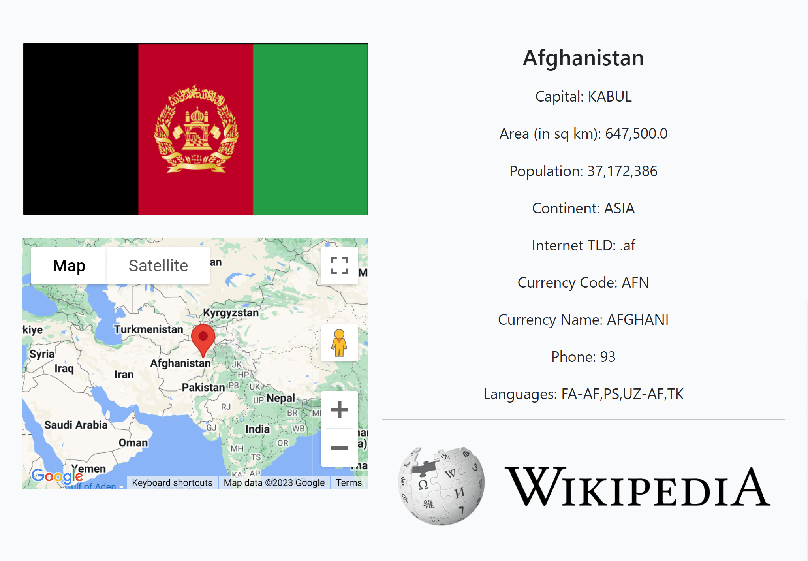

# Travel blog


Welcome to our vibrant travel community! At our travel blog, we strive to create
a
space where passionate globetrotters can come together, share their adventures,
and
find inspiration for their next journey.

Whether you're an avid explorer or an armchair traveler, our platform offers an
array
of captivating travel narratives, insightful comments, and a seamless
user-friendly
interface.

Explore fascinating travelogues, leave your thoughts, and unearth comprehensive
country
details effortlessly through our convenient search feature. Join us in
celebrating the
joy of exploration and discovery!<br>
<a href="https://project-4-gennadiy-gaysha-3d98b941946a.herokuapp.com/" target="_blank">
Here is the live version of my project</a>

## Table of Contents

1. [User Experience (UX)](#user-experience-ux)
    1. [Project Goals](#project-goals)
    2. [User Stories](#user-stories)
    3. [General structure](#general-structure)
    4. [Database Models](#database-models)
    5. [Color Scheme](#color-scheme)
    6. [Topography](#topography)
2. [Features](#features)
    1. [General](#general)
    2. [Navigation Bar & Footer](#navigation-bar--footer)
    3. [Home Page](#home-page)
    4. [Post Details Page](#post-details-page)
    5. [Create Post Page](#create-post-page)
    6. [Update Post Page](#update-post-page)
    7. [Delete Post Page](#delete-post-page)
    8. [Show Country Page](#show-country-page)
    9. [Author bio page](#author-bio-page)
    10. [Authentication Pages](#authentication-pages)
    11. [Edit Details Page](#edit-details-page)
    12. [Change Password Page](#change-password-page)
    13. [Create User Profile Page](#create-user-profile-page)
    14. [Update User Profile Page](#update-user-profile-page)
    15. [About Page](#about-page)
    16. [Error Pages](#error-pages)
3. [Technologies Used](#technologies-used)
    1. [Languages Used](#languages-used)
    2. [Libraries and Frameworks](#libraries-and-frameworks)
    3. [Packages Installed](#packages-installed)
    4. [Database Management](#database-management)
    5. [Tools and Programs](#tools-and-programs)
4. [Testing](#testing)
5. [Creating empty django project in PyCharm](#creating-empty-django-project-in-pycharm)
6. [Deploying empty django project to Heroku](#deploying-empty-django-project-to-heroku)
7. [Creating structure for static and template files](#creating-structure-for-static-and-template-files)
8. [Get static and media files stored on Cloudinary](#get-static-and-media-files-stored-on-cloudinary)
9. [Populating Geonames country data in database](#populating-geonames-country-data-in-database)
10. [Finished product and responsive design](#finished-product-and-responsive-design)
11. [Features to be implemented](#features-to-be-implemented)
12. [Deploying finished django project to Heroku](#deploying-finished-django-project-to-heroku)
13. [Cloning and Forking Repository](#cloning-and-forking-repository)
    1. [Cloning the Repository](#cloning-the-repository)
    2. [Forking the Repository](#forking-the-repository)
14. [Credits](#credits)
15. [Acknowledgements](#acknowledgements)

## User Experience (UX).

### Project Goals:

The project aims to achieve a set of well-defined goals, each falling under one
of the five primary epics. These epics, namely Admin Management, Post
Management, Search and Filtering, User Management and Error Handling represent
distinct aspects of the travel blog application. Each section within the project
goals is designed to address specific requirements related to these epics,
ensuring a cohesive and efficient implementation of the application.

<br>[Back to top ⇧](#table-of-contents)

#### Admin Management:

- Implement a comprehensive user management control system, including user
  registration, profile creation and management, secure login and logout
  mechanism, and password change feature.
- Provide efficient blog content management for administrators, enabling post
  creation, editing, and deletion, as well as content moderation.
- Enable the management of country and user comments within the admin panel for
  enhanced control and organization.
- Implement a user-friendly interface for managing the 'About Us' page
  within the admin panel.

<br>[Back to top ⇧](#table-of-contents)

#### Post Management:

- Enable users to open and read blog posts seamlessly, focusing on user
  experience.
- Display comprehensive 'About Us' information on the website for users.
- Implement a paginated list of posts for a streamlined browsing experience.
- Provide the functionality to create new blog posts easily and efficiently.
- Allow the editing and deletion of posts by authorized users for better
  content management.
- Enable users to like and comment on posts, fostering engagement and
  interaction.

<br>[Back to top ⇧](#table-of-contents)

#### Search and Filtering:

- Provide a country information search feature to enable users to find
  relevant information quickly.
- Categorize posts by the author's name and location to facilitate efficient
  searching and filtering.

<br>[Back to top ⇧](#table-of-contents)

#### User Management:

- Ensure a robust account registration functionality for new users to sign up
  easily.
- Implement a secure login and logout mechanism to protect user accounts and
  data.
- Allow users to change their passwords conveniently for security purposes.
- Provide comprehensive user profile creation and management capabilities for a
  personalized user experience.
- Enable users to view their profiles and manage them as needed.

<br>[Back to top ⇧](#table-of-contents)

#### Error Handling:

- Implement a robust and user-friendly error handling system to enhance the
  overall user experience on the platform.
- This includes creating custom error pages for scenarios like access denial (
  403 Forbidden), page not found (404 Not Found), and internal server errors (
  500 Internal Server Error).
- These pages should provide clear and informative messages, guiding users on
  how to proceed or reassuring them during unexpected issues.
- Ensure users feel supported and informed, even when encountering errors,
  contributing to a positive and professional user interaction with the
  application.

<br>[Back to top ⇧](#table-of-contents)

### User stories:

Prior to commencing the project, a comprehensive compilation of 19 user stories
was developed to cater to the requirements of both the Admin and the User,
effectively addressing their expectations for the travel blog site. Based on the
project's structure and the significance of each user story, they were organized
in a sequence that is presented in the project development strategy table.

| No | Title                                    | User Story                                                                                                                                                                                                                                 | Epic                 | Tag         |
|----|------------------------------------------|--------------------------------------------------------------------------------------------------------------------------------------------------------------------------------------------------------------------------------------------|----------------------|-------------|
| 1  | Paginated List of Posts                  | As a user I can view a paginated list of posts so that I can easily find and access various blog entries                                                                                                                                   | Post Management      | MUST HAVE   |
| 2  | Content Moderation for Admin             | As a site Admin I can monitor and manage user-generated content so that maintain a safe and high-quality platform                                                                                                                          | Admin Management     | MUST HAVE   |
| 3  | Blog Content Management for Admin        | As a site admin I can create, read, update, make drafts and delete posts using admin panel so that I can manage my own blog content                                                                                                        | Admin Management     | MUST HAVE   |
| 4  | Country and Comment Management for Admin | As a site admin I can manage countries and comments within the platform so that I could oversee user interactions and ensure a safe and engaging community environment                                                                     | Admin Management     | MUST HAVE   |
| 5  | Create New Blog Posts                    | As a user I can create new blog posts with text and images so that I can share my experiences and insights with others                                                                                                                     | Post Management      | MUST HAVE   |
| 6  | Open and Read a Post                     | As a user I can open and read a post so that I could delve into the content and explore its details                                                                                                                                        | Post Management      | MUST HAVE   |
| 7  | Edit and Delete Posts                    | As a user I can edit and delete my own posts so that I have control over the content I publish and can keep it up to date                                                                                                                  | Post Management      | MUST HAVE   |
| 8  | Account Registration Functionality       | As a user I can register and create account so that I can access exclusive features and personalized content                                                                                                                               | User Management      | MUST HAVE   |
| 9  | User Management Controls                 | As a site Admin I can manage user accounts so that I could ensure platform integrity and user compliance                                                                                                                                   | Admin Management     | MUST HAVE   |
| 10 | Secure Login and Logout Mechanism        | As a user I can log in and log out securely so that so that my account remain protected and accessible only by me                                                                                                                          | User Management      | MUST HAVE   |
| 11 | User Profile Creation and Management     | As a user I can create, update and personalize my profile after registration so that I can share my preferences and information with the community in a customized manner                                                                  | User Management      | MUST HAVE   |
| 12 | User Profile Viewing Capability          | As a user I can see other users' profiles so that I can connect and engage with other members of the community, fostering collaboration and interaction                                                                                    | User Management      | SHOULD HAVE |
| 13 | Password Change Feature                  | As a user I can change password so that I can maintain the security of my account and information.                                                                                                                                         | User Management      | SHOULD HAVE |
| 14 | Categorize Posts by Location             | As a user I can utilize a system for categorizing and filtering posts by country so that I can easily navigate and explore content related to specific locations                                                                           | Search and Filtering | SHOULD HAVE |
| 15 | Country Information Search Feature       | As a user I can quickly search and access brief information about a specific country so that I can gather essential details without extensive navigation or research                                                                       | Search and Filtering | SHOULD HAVE |
| 16 | Display About Us Information             | As a user I can view the About Us page so that I can stay informed about the mission, and understand the platform's purpose and offerings                                                                                                  | Post Management      | MUST HAVE   |
| 17 | Manage About Us Page in the Admin Panel  | As a site admin I can I can manage and update the About Us page through an intuitive interface within the Django admin panel so that the TravelBlog mission, purpose, and latest information are accurately presented to the site visitors | Admin Management     | MUST HAVE   |
| 18 | Like and Comment on Posts                | As a user I can like and comment on blog posts so that I can engage with the community, express my thoughts, and show appreciation for interesting content                                                                                 | Post Management      | SHOULD HAVE |
| 19 | User-Friendly Error Pages                | As a user I can see friendly error pages when something goes wrong on the site so that I can better understand and navigate issues that might occur                                                                                        | Error Handling       | SHOULD HAVE |
| 20 | Categorize Posts by Author's Name        | As a user I can utilize a system for categorizing and filtering posts by author's name so that I can easily navigate and explore content related to specific author                                                                        | Search and Filtering | WON'T HAVE  |

<br>[Back to top ⇧](#table-of-contents)

### General structure:

The key component of the site is the navbar, which is structured to enable users
to access any section of the site with minimal number of clicks. This ensures a
seamless and intuitive navigation experience for the site's users.


* The header, footer, and navigation bar maintain consistency across all pages.
* Upon registering an account and creating their profile, users can add extra
  content to the site.

<br>[Back to top ⇧](#table-of-contents)

### Database models:

The database models have been designed using [Lucidchart](https://lucid.app/).
In this chart, only a few of the most important fields from the inherited
Django User model are displayed. For a complete description of the User model's
fields, please refer to the information provided below.
For the purpose of this project relational database
[ElephantSQL](https://www.elephantsql.com/) was used.


#### Inherited Django User Model:

- **Username:** This is the user's unique username and is used for
  identification purposes.
- **Email:** It represents the user's email address, which is also unique and is
  frequently used for authentication and communication.
- **Password:** It stores the user's password, which is secured and encrypted in
  the database.
- **First Name and Last Name:** These fields store the user's first name and
  last name, respectively.
- **Date Joined:** This field records the date when the user joined the platform
  or when their account was created.
- **Is Active:** This Boolean field indicates whether the user's account is
  active or not. If it is set to True, the account is active; otherwise, it is
  not active.
- **Is Staff:** This Boolean field indicates whether the user is a staff member
  or not. Staff members typically have additional permissions.
- **Is Superuser:** This Boolean field identifies whether the user has
  administrative privileges. Superusers have all permissions and access to all
  functionalities within the Django project.
- **Last Login:** This field records the last time the user logged into the
  system.

#### Post model:

- **Title:** This field stores a unique title for each post provided by the
  author.
- **Slug:** The unique slug field is used to identify the post.
- **Author:** This field represents the author of the post and is linked to the
  User model.
- **Updated On:** The date and time are automatically set every time the post is
  updated.
- **Content:** This field stores the content of the post as provided by the
  author.
- **Status:** It is an integer field that stores the status of the post,
  selected from predefined choices.
- **Featured Image:** This field is used to store the image related to the post,
  using CloudinaryField.
- **Excerpt:** It stores a brief excerpt related to the post, and it can be left
  blank.
- **Created On:** The date and time are set automatically at the post's
  creation.
- **Likes:** This field represents the many-to-many relationship between users
  and posts, allowing users to like posts.
- **Country:** This field represents the foreign key linking the post to a
  specific country in the Country model.

#### Country Model:

- **ISO, ISO3, ISO Numeric, FIPS:** These fields store specific codes associated
  with the country.
- **Country Name:** This unique field stores the name of the country.
- **Slug:** A unique slug is assigned to each country to identify it.
- **Capital:** It holds the name of the capital city of the country.
- **Area in Square Kilometers:** This field stores the area of the country in
  square kilometers.
- **Population:** It represents the population count of the country.
- **Continent:** This field stores the name of the continent where the country
  is located.
- **TLD:** It holds the top-level domain code associated with the country.
- **Currency Code and Name:** These fields store the code and name of the
  currency used in the country.
- **Phone:** It stores the phone code of the country.
- **Postal Code Format and Regex:** These fields represent the format and
  regular expression associated with the postal code of the country.
- **Languages:** This field stores the languages spoken in the country.
- **Geo Name ID:** It stores the unique Geo Name ID assigned to the country.
- **Neighbours:** This field is dedicated to storing the names of neighboring
  countries.

#### Comment model:

- **Post:** This field serves as a foreign key, linking the comments to the
  related post, ensuring that when a post is deleted, the associated comments
  are deleted as well.
- **Name:** It stores the name of the commenter, with a maximum length of 80
  characters.
- **Email:** This field stores the email address of the commenter.
- **Body:** It stores the actual text content of the comment.
- **Created On:** This field automatically stores the date and time when the
  comment was created.
- **Approved:** It is a boolean field that indicates whether the comment has
  been approved or not. If approved, the value is set to True; otherwise, it is
  set to False.

#### UserProfile Model

- **User:** This field serves as a one-to-one relationship with the User model,
  ensuring that each user has a single profile. If a user is deleted, their
  associated profile is deleted as well.
- **Profile Picture:** This field is used to store the image of the user
  profile, utilizing the Cloudinary service. If no image is provided, a
  placeholder image is used as the default.
- **Bio:** It stores the biography of the user, allowing for a longer text
  input.
- **Date of Birth:** This field stores the date of birth of the user. It allows
  blank values and null values to be set.
- **Gender:** It provides a selection for the gender of the user, with choices
  including 'Male,' 'Female,' and 'Other.'
- **Home Country:** This field serves as a foreign key to the Country model,
  indicating the home country of the user.
- **Instagram Profile, Twitter Profile, Facebook Profile, LinkedIn Profile:**
  These fields store the URLs of the user's social media profiles, allowing the
  user to provide links to their social media accounts.

#### About Model

- **Title:** This field allows for a maximum of 200 characters for the title,
  with the option for it to be left blank.
- **Content:** It is a field that stores the detailed content or information for
  the 'About' section. The text can be as long as needed.
- **Featured Image:** This field utilizes Cloudinary to store the image for
  the 'About' section. If no image is provided, a placeholder image is used as
  the default.
- **Created On:** This field stores the date and time when the 'About' content
  was created. By default, it takes the current time as the creation time.

<br>[Back to top ⇧](#table-of-contents)

### Color scheme:

The color scheme palette for the project was created using the
[Colors](https://coolors.co/), which involved the selection of complementary and
contrasting colors.

To provide a complete representation, the first color in the Primary Colors
palette (Seasalt) corresponds to the main color of the pattern, which has been
chosen as the background for the entire project.

**Primary colors palette**


**The colors used in the website are as follows:**

- background image for all
  pages: [@lifeforstock](https://www.freepik.com/free-photo/abstract-surface-textures-white-concrete-stone-wall_4326138.htm)
- background color for the nav bar and the footer: #253A47
- logo colors: #FFA500 and #23BBBB
- post card colors: #23BBBB and #445261
- button colors: #6C757D and #198754
- text-colors: #FFFFFF, #23BBBB, #212529 and #198754
- hover-text colors: #6C757D, #FFFFFF, #BA2323, #125D5D

The color scheme was selected to strike a balance between a contemporary design
and a simple, user-friendly interface, ensuring that the content remains the
focal point while also delivering an attractive layout for users.
<br>[Back to top ⇧](#table-of-contents)

### Topography:

- The main font used on the site is Roboto, with a sans-serif font as a
  fallback in case the main font is not imported correctly.
- Lato was used for the logo design.

<br>[Back to top ⇧](#table-of-contents)

## Features.

### General:

* The website was built with a mobile-centric approach.
* The website was developed to ensure optimal performance across various
  devices, including mobile phones, tablets, etc.

<br>[Back to top ⇧](#table-of-contents)

### Navigation Bar & Footer:

* Includes the main logo, colored greeting and section links.
* Logo image is linked to the [home page](#home-page).
* The navigation bar features links to all sections, enhancing ease of
  navigation throughout the site. Additionally, it incorporates a hover effect
  that changes color, providing users with visual feedback for an improved
  browsing experience.

**Depending on the user status, nav bar has two different state:**

1. Unauthorized user:
   
2. Authorized user:
   

* The 'My Profile' dropdown menu toggles between 'Create Profile' and 'Show
  Profile'/'Edit Profile' choices based on whether the user has created their
  profile or not.
* The 'My Posts' dropdown menu provides three options: 'Drafts', 'Awaiting
  Moderation', and 'Published', allowing authorised post authors to view their
  paginated list of posts for each corresponding status.
* The search country info window enables users to easily access country
  profiles.
  
* If the user clicks on the search bar without entering any text, a
  comprehensive list of all countries is displayed. Otherwise, a list of
  countries containing the user's search query in any part of the country name
  is generated. All countries in the list are arranged in alphabetical order.
  Each country in the list is linked to its profile. The search query is not
  case-sensitive.


* The footer includes the TravelBlog trademark, which is linked to the main
  page, and links to various social media channels.
  

<br>[Back to top ⇧](#table-of-contents)

### Home Page:

* The home page presents a paginated list of posts, with 3 posts displayed per
  page, and includes a filter for selecting posts by country.
* The home page also provides information about the total number of posts,
  that are filtered and unfiltered.
* To improve user experience, all post titles are truncated if they exceed 30
  characters, and post excerpts are truncated if they exceed 40 characters.
* Each post card on the paginated list of posts contains links to the
  [author bio page](#author-bio-page) and
  the [show country page](#show-country-page),
  along with the date when the post was created and the total number of likes.
  This provides clear feedback for the user.

  

<br>[Back to top ⇧](#table-of-contents)

### Post Details Page:

* Clicking on a post title or excerpt on the paginated list of posts redirects
  the user to the post details page.
* To improve the user experience, all post titles are truncated if they exceed
  25 characters.
* To maintain the author's writing style, the original title and excerpts are
  presented before the post content.
* At the end of the content, there is a comment section where other users'
  comments and post likes can be found. If you are not the post author, you can
  also like the post or leave a comment, provided that you have created your
  user profile.
* For better user experience, each comment contains the user's name, which is
  linked to their profile page, and the date the comment was created.
  
* Two buttons are available at the end of the post content for the authorized
  post author, enabling them to edit or delete the post.
* The post author is unable to like their own posts or leave a comment on them.
  

<br>[Back to top ⇧](#table-of-contents)

### Create Post Page:

* An authorized user with a user profile can create their own posts by clicking
  on the 'Create post' button on the [navigation bar](#navigation-bar--footer).
* The 'Create post' page contains various fields such as 'Country' (a dropdown
  list of all countries previously uploaded to the database), 'Title' (which
  should be unique), 'Post main image' (with a default post image option
  available), 'Excerpt', 'Content' (featuring the embedded Summernote WYSIWYG
  Editor), and a dropdown 'Status' list to save the post as Draft for future
  editing or send it for Moderation.
  
* If the user doesn't have a profile, they are kindly asked to create one if
  they wish to have the ability to publish their posts or comments.
  

<br>[Back to top ⇧](#table-of-contents)

### Update Post Page:

* Authors can update their posts at any time regardless of their status ('
  Draft', 'Awaiting approval', or 'Published').
* All updated posts must be approved by the Admin before they are published.
  

<br>[Back to top ⇧](#table-of-contents)

### Delete Post Page:

* Authors can also delete their posts at any time, regardless of their status ('
  Draft', 'Awaiting approval', or 'Published').
* Before deleting the post, the user is asked to confirm this action since
  this action can not be undone.
  

<br>[Back to top ⇧](#table-of-contents)

### Show Country Page:

* The user can access this page through three different links: via the
* [home page](#home-page), the [post details page](#post-details-page), and the
  search country result page.
* This page includes a brief country description, the country's flag, an
  interactive Google map, and a Wikipedia link.
  

<br>[Back to top ⇧](#table-of-contents)

### Author bio page:

* Users can access this page via two different links: through the
  [home page](#home-page) and through the
  [post details](#post-details-page) page.
* The page displays the user's uploaded image (with three default images
  available for different genders), the user's name, a short user bio, and other
  data from the user's profile.
* At the bottom of this page, you can find all the user's published posts,
  each linked to its corresponding [post details](#post-details-page) page.
  

<br>[Back to top ⇧](#table-of-contents)

### Authentication Pages:

* To enhance the user experience and reduce the number of required clicks, it
  was determined not to prompt for confirmation when the user chooses to log
  out.

| Page     | Description                                                    | Screenshot                                                        |
|----------|----------------------------------------------------------------|-------------------------------------------------------------------|
| Register | Allows the site user to sign up for an account on the website. |  |
| Login    | Allows the Site User to sign in with their account.            |     |

<br>[Back to top ⇧](#table-of-contents)

### Edit Details Page:

* Enables the user to modify their first name, last name, and email.
* After creation, the user is unable to change their username.
  

<br>[Back to top ⇧](#table-of-contents)

### Change Password Page:

* Enables the user to change their password, requiring them to provide their old
  password for confirmation before proceeding.
  

<br>[Back to top ⇧](#table-of-contents)

### Create User Profile Page:

* To add additional content to the site, users are required to create a user
  profile upon registration.
* The form includes various fields such as 'Image' for uploading a user's
  image (with three default images available for different genders), 'Bio',
  dropdown fields for selecting 'Home country' and 'Gender', 'Date of birth'
  field (featuring an interactive date picker calendar), and more.
  

<br>[Back to top ⇧](#table-of-contents)

### Update User Profile Page:

* After creating their profile, users can update it at any time if needed.
  

<br>[Back to top ⇧](#table-of-contents)

### About Page:

* Provides relevant details about the website's purpose and goals.
* Enables the site admin to create or update the 'About' page.
* Includes a default image option.
  

<br>[Back to top ⇧](#table-of-contents)

### Error Pages:

#### 403 Forbidden Error Page:

The custom 403 error page serves as a user-friendly response when a client
attempts to access a resource for which they don't have the necessary
permissions. It communicates a clear message that the user is not authorized to
view the requested content and provides a link to redirect them to the homepage
for navigation.


#### 404 Not Found Error Page:

The custom 404 error page delivers a helpful response when a user tries to
access a page or resource that doesn't exist on the website. It presents a
friendly message informing the user about the non-existent page and guides them
back to the homepage for a seamless navigation experience.


#### 500 Internal Server Error Page:

The custom 500 error page is displayed when an unexpected server-side issue
occurs. It conveys a message to the user that something went wrong on the
server, apologizes for the inconvenience, and provides a link to return to the
homepage. This page helps maintain a positive user experience by acknowledging
the error and offering a way to continue exploring the site.


<br>[Back to top ⇧](#table-of-contents)

## Technologies Used.

### Languages Used:

* [HTML5](https://en.wikipedia.org/wiki/HTML)
* [CSS3](https://en.wikipedia.org/wiki/CSS)
* [JavaScript](https://en.wikipedia.org/wiki/JavaScript)
* [Python](https://en.wikipedia.org/wiki/Python_(programming_language))

<br>[Back to top ⇧](#table-of-contents)

### Libraries and Frameworks:

* [Django](https://www.djangoproject.com/) was employed as the web framework.
* [Bootstrap 5](https://getbootstrap.com/docs/5.0/getting-started/introduction/)
  was used to enhance the visual appeal and responsiveness of the website.
* [Google Fonts](https://fonts.google.com) were imported into the HTML file
  to ensure consistent and appealing typography across all sections of the
  website.
* [Font Awesome](https://fontawesome.com) was employed across the website to
  incorporate icons for improved aesthetics and user experience.
* [jQuery 3.6.0 datepicker widget](https://jqueryui.com/datepicker/) was
  integrated as part of the JavaScript library to streamline the process of
  writing less JavaScript code.

<br>[Back to top ⇧](#table-of-contents)

### Packages Installed:

* [Django filter](https://django-filter.readthedocs.io/en/stable/) was used
  to filter down a queryset based on a model’s fields.
* [Django Crispy Form](https://django-crispy-forms.readthedocs.io/en/latest/)
  was utilized to manage the appearance and rendering of the forms.
* [Gunicorn](https://gunicorn.org/) was employed as a Python WSGI HTTP
  Server for UNIX systems to facilitate the deployment of the Django
  application.
* [Summernote](https://summernote.org/) was utilized as the text editor with
  a user-friendly interface that allows for the creation and editing of rich
  text content.
* [Cloudinary](https://cloudinary.com/) was utilized as an image management
  solution, facilitating the storage, manipulation, and delivery of images for
  the website.

<br>[Back to top ⇧](#table-of-contents)

### Database Management:

* [Elephant PostgreSQL](https://www.elephantsql.com/) database instance was
  set up to be accessed in the production environment by Heroku.

<br>[Back to top ⇧](#table-of-contents)

### Tools and Programs:

* [PyCharm](https://www.jetbrains.com/pycharm/) was employed as the
  integrated development environment (IDE) to facilitate efficient Django
  development.
* [Git](https://git-scm.com) was employed for version control by using the
  PowerShell terminal to commit changes to Git and push them to GitHub.
* [GitHub](https://github.com) was utilized to store the project's code
  after it was pushed from Git.
* [Heroku](https://www.heroku.com) was utilized for the deployment of the
  website.
* [Device Website Mockup Generator](https://techsini.com/multi-mockup/index.php)
  was employed to preview the website on a range of popular devices.
* [Tiny PNG](https://tinypng.com) was used to reduce the file size of the
  images.
* [Coolors](https://coolors.co) was utilized to craft a color scheme for the
  website.
* [Chrome DevTools](https://developer.chrome.com/docs/devtools/) were
  employed during the development process for code review and to test
  responsiveness.
* [W3C Markup Validator](https://validator.w3.org/) was used to validate the
  HTML code.
* [W3C CSS Validator](https://jigsaw.w3.org/css-validator/) was used to
  validate the CSS code.
* [JSHint JavaScript Code Quality Tool](https://jshint.com/) was employed to
  verify the integrity of the site's JavaScript code.
* [Canva](https://www.canva.com/) was used to create the site favicon.
* [GeoNames](https://www.geonames.org/) geographical database was utilized
  to fetch and import detailed countries data into the project's database.
* [Google Cloud](https://console.cloud.google.com/) was utilized to gain
  access to the Google Maps API, enabling the rendering of country maps and the
  addition of markers (for each country's capital) to them.
* [Wikipedia](https://www.wikipedia.org/) was employed to generate links to
  the country flag image and respective Wikipedia country page.
* [Lorem Ipsum](https://www.lipsum.com/) was employed to generate placeholder
  text for post content and excerpt.

<br>[Back to top ⇧](#table-of-contents)

## Testing.

You can explore the testing procedures conducted for this project by referring
to the dedicated [TESTING.md](TESTING.md) file (use CTRL + Click to open this
link in a new tab/window). For targeted information, you can directly access
specific sections of the file by clicking on the relevant headings below:

<br>[Back to top ⇧](#table-of-contents)

## Creating empty django project in PyCharm.

1. Virtual environment:

    - Create project directory and open it in PyCharm. Delete default main.py
      file after opening in PyCharm.
    - Before creating a Django project, it's a good practice to create a virtual
      environment for it. This isolates project's dependencies from the
      system-wide
      Python installation. Go to the terminal and run the command:
      <br>`python -m venv venv_name`
    - Activate the virtual environment (on Windows):
      <br>`venv_name\Scripts\activate`
    - When you're done working on your project, deactivate the virtual
      environment:
      <br>`deactivate - exits venv_name`
    - Whenever you want to continue working on your project, activate the
      virtual
      environment first:
      <br>`venv_name\Scripts\activate`
    - !!! PyCharm provides an option to automatically activate the virtual
      environment
      associated with a project whenever you open a terminal within the IDE.
      <br>`File>Settings>Tools>Terminal>Activate virtualenv (check/uncheck)`
    - While your virtual environment is active, go to the next step.

2. Add Python interpreter to the project, clicking OK button to add
   interpreter after choosing the path to it:
   <br>`PyCharm > File > Settings > Project_name > Python Interpreter > Add
   Interpreter > absolute_path_to_your_project\venv_name`

3. When deploying a Django project to Heroku, you will typically need to use a
   web server to serve your application. Gunicorn (short for "Green Unicorn") is
   a commonly used web server that is recommended for deploying Django
   applications on Heroku. Heroku's platform expects the application to be run
   using a web server that can handle incoming HTTP requests.

   Gunicorn is one of the most popular choices because it is a production-ready
   WSGI server (Web Server Gateway Interface) that can handle serving Django
   applications efficiently and securely.

   While your virtual environment is active, install Django and gunicorn using
   pip. You don't need to install Django globally on your system.
   <br>`pip install 'django<4' gunicorn`

4. Install supporting libraries (in this project psycopg2 was used to
   connect to PostgreSQL):
   <br>`pip install dj_database_url==0.5.0 psycopg2 python-dotenv`

5. Install Cloudinary Libraries:
   <br>`pip install dj3-cloudinary-storage urllib3==1.26.15`

6. If you need additional packages for your project, you can install them
   while your virtual environment is active:
   <br>`pip install package_name_1 package_name_2 package_name_3`

7. After installing all packages create requirements.txt file:
   <br>`pip freeze > requirements.txt`

8. Create Project: Once you're in the desired directory, you can create your
   Django project using the django-admin startproject command followed by the
   project name. For example, if you want to name your project travelblog, you
   can run:
   <br>`django-admin startproject travelblog .`

    - !!! The `.` at the end indicates that the project should be created in the
      current directory. This will create travelblog directory with the initial
      project files.

9. Create App (blog):
   <br>`python manage.py startapp blog`

10. Add newly created app to the end of INSTALLED_APPS variable in settings.py:

```
INSTALLED_APPS = [
    'blog',
]
```

11. Now that the empty project is created we need to connect external
    [ElephantSQL](https://www.elephantsql.com/) database to it.

12. ElephantSQL Setup

- Go to [ElephantSQL](https://www.elephantsql.com/) and either create an
  account or log in.
- Click on 'Create New Instance' located in the top right corner of the screen.
- Enter an Instance or Database name, select an appropriate Plan (the free
  version will suffice), and click 'Select Region'.
- Choose a region from the dropdown menu, click 'Review', and then click '
  Create instance'.
- Go back to the dashboard and click on the name of the instance you just
  created.
- In the URL section, click on the copy icon to copy the database URL.

13. To hide sensitive data (such as the Django secret key) in a Django project
    using the dotenv library, (was installed in p.4), you can follow these
    steps:

- In project's root directory create 2 files:
  `.gitignore` and `.env`
- In `.env` you'll store your sensitive data.
- Place your SECRET_KEY value (from settings.py) and DATABASE_URL value (URL
  from your remote third party database - elephantsql.com) in it:

```
SECRET_KEY = 'my_secret_key'
DATABASE_URL = 'my_elephantsql_url'
```

- !!! in DATABASE_URL in `.env` file insert port number:
  <br>`...elephantsql.com:5432/...`

14. Access to Environment Variables:

- Open your Django project's settings.py file and import (at the top) the dotenv
  and other supporting libraries:

```
import os
from pathlib import Path
import dotenv

dotenv.load_dotenv()
import dj_database_url
```

- Use the `os.environ` dictionary to access the environment variables from the
  `.env` file. For example, to access the secret key:
  `SECRET_KEY = os.environ.get('SECRET_KEY')`

- To access remote database (!replace the local database with a remote
  database):

```
DATABASES = {
    'default': dj_database_url.parse(os.environ.get("DATABASE_URL"))
}
```

- Replace 'SECRET_KEY' with the actual name of the environment variable you
  defined in your `.env` file (if needed).
- It's crucial to add `.env` to your `.gitignore` file (also place it in root
  directory) so that you don't accidentally commit sensitive data to version
  control. Also add venv directory and local db to `.gitignore`:
  <br>`.env`
  <br>`venv_name/`
- add this line to .gitignore if you occasionally run your django project before
  cannecting it with the external
  database:
  <br>`db.sqlite3`

- Usage of `.env` in Production: In production environments, you can manually
  set
  environment variables using the server's configuration or a service like
  Heroku's config vars.

15. To ensure that the database schema is up-to-date and ready to accommodate
    any models you define in the future, run this command:
    `python manage.py migrate`


16. Run Server in PyCharm for the first Test:
    <br>`current file (dropdown menu) > Edit Configuration > Add new configuration > Python`

- Give any reasonable name to your configuration in the first top field (e.g.,
  your project's name).
  <br>`Script Path: enter path to the project's <manage.py> file`
  <br>`Parameters: runserver`
- Click OK to save configuration.
- Now, each time you need to run your project, instead of running the
  command `python manage.py runserver` in your
  terminal, just click the green RUN button (or red square to stop it) in
  PyCharm menu bar.

<br>[Back to top ⇧](#table-of-contents)

## Deploying empty django project to Heroku.

1. Heroku setup:

- Navigate to [Heroku](https://heroku.com) and create an account/log in.
- Click 'New' in the top right and select 'Create New App'.
- Enter an App name (must be unique), choose a region, and then click 'Create
  app'.
- Select 'Settings' in the menubar
- Click 'Reveal Config Vars' and add the following:<br>
    - DATABASE_URL: the DATABASE_URL copied from `.env` (p.13)
    - SECRET_KEY: The SECRET_KEY copied from `.env`
    - PORT: 8000
    - DISABLE_COLLECTSTATIC: 1 (temporary step, will be removed
      before deployment)

2. Procfile: Create a file named Procfile (without any file extension) in your
   project's root directory. The Procfile tells Heroku how to run your
   application. Inside the Procfile, add the following line (inserting your
   project's name):
   <br>`web: gunicorn your_project_name.wsgi:application`


3. Add to ALLOWED_HOSTS in settings.py:

- First go to 'Settings' tab of your newly created Heroku app.
- Go to the 'Domains' line and copy url that goes just after `https://`
- Go to settings.py file of your project, add to the allowed hosts your
  local domain and paste the url you copied in the previous step:

```python
ALLOWED_HOSTS = ["127.0.0.1", "your_full_heroku_project_name.herokuapp.com"]
```

4. Create a new repository on GitHub to which you will push your local
   repository.
5. In terminal window go to your project's root folder and initialise your
   project in git: `git init`
6. Move your project to the staging area: `git add .`
7. Commit your project: `git commit -m 'your commit message'`
8. Push your project to GitHub:
   <br>`git remote add origin https://github.com/your_github_user_name/your_project_name.git`
   <br>`git branch -M main`
   <br>`git push -u origin main`
   (Next time when you want to push your commit to GitHub, just run the
   command `git push`.)
9. First deployment to Heroku.

- Click 'Deploy' in the menubar tab then 'GitHub' under 'Deployment method'
- In "Deployment method" select GitHub, chose the repository you want to deploy
  and click 'Connect'
- Scroll down and click 'Deploy Branch' or choose 'Enable Automatic Deploys' to
  complete the process.
- To launch your site after deployment, click 'Open app' button in the
  top right corner of Heroku dashboard.

10. In case of any Heroku errors after deployment go to the terminal and:

- login to heroku terminal using command:
  <br>`heroku login -i`
- in case you have Multi-Factor Authentication, use API key from your
  Heroku Account settings as a password;
- run the command:
  <br>`heroku logs --app=your_heroku_app_name`
- find and resolve the issue;
- commit your changes again and deploy it to Heroku (if you have chosen
  'Manual deploy').

11. !!! Important: to avoid any extra charges, in your Heroku app go to
    'Resources' tab and remove Add-ons.

<br>[Back to top ⇧](#table-of-contents)

## Creating structure for static and template files.

- For this django project, all static files (CSS, JavaScript, images) and
  templates (HTML files) were organized in a conventional directory
  structure:

```lua
my_project/
|-- my_project_name/
|   |-- __init__.py
|   |-- settings.py
|   |-- urls.py
|   |-- asgi.py
|   `-- wsgi.py
|-- my_app/
|   |-- migrations/
|   |-- static/
|   |   `-- my_app_name/
|   |       |-- css/
|   |       |   `-- style.css
|   |       |-- js/
|   |       |   `-- script.js
|   |       |-- img/
|   |       |   `-- logo.png
|   |       `-- favicon.ico
|   |-- templates/
|   |   `-- my_app_name/
|   |       |-- home.html
|   |       `-- other_template.html
|   |-- __init__.py
|   |-- admin.py
|   |-- apps.py
|   |-- models.py
|   |-- tests.py
|   `-- views.py
|-- manage.py
|-- static/
|   |-- css/
|   |   |-- style.css
|   |-- img/
|   |   |-- favicon.png
|   |-- js/
|       |-- base.js
|-- templates/
|   |-- base.html
|-- venv/
`-- requirements.txt
```

- my_project_name/static/my_app_name/: This directory contains all static
  files for the specific app. Each app within a Django project can have its own
  static files.
- my_app_name/templates/: This directory contains all HTML templates for the
  specific app. Similarly, each app can have its own templates.
- static/: Static files that are not tied to a specific app but are shared
  across the entire project.
- templates/: This is a common directory for global templates that are shared
  across multiple apps. For example, a base template (base.html) is placed
  here.

<br>[Back to top ⇧](#table-of-contents)

## Get static and media files stored on Cloudinary.

### Cloudinary setup:

- Visit [Cloudinary website](https://cloudinary.com/)
- Click on the Sign-Up For Free button.
- Provide your name, email address and choose a password.
- Click Create Account.
- Verify your email, and you will be brought to the dashboard.
- From Cloudinary Dashboard copy your CLOUDINARY_URL e.g. 'API Environment
  Variable'.
- Add (paste) Cloudinary URL to `.env`: `CLOUDINARY_URL=...`
- In Heroku app add to Settings tab in Config Vars your CLOUDINARY_URL.
- In settings.py add Cloudinary Libraries to installed apps (order is
  important):

```python
INSTALLED_APPS = [
    'cloudinary_storage',
    'django.contrib.staticfiles',
    'cloudinary',
]
```

- Tell Django to use Cloudinary to store media and static files.
  Place this code snippets under the STATIC_URL:
  <br>`STATICFILES_STORAGE = 'cloudinary_storage.storage.
  StaticHashedCloudinaryStorage'`
  <br>This line below defines a list of additional directories where Django will
  look for static files. In this case, it specifies that the 'static' directory
  within the project's base directory (BASE_DIR) should be considered when
  collecting static files. This is useful when you have static files that are
  not tied to a specific app but are shared across the entire project:
  <br>`STATICFILES_DIRS = [os.path.join(BASE_DIR, 'static')]`
  <br>This line below (!!! provided as a note for a standard Django project,
  but not utilized in this project due to the use of Cloudinary storage) sets
  the absolute path to the directory where `collectstatic`, a Django management
  command, will collect and store all the static files from your project. In
  this code, it specifies that the collected static files should be placed in
  the 'staticfiles' directory within the project's base directory (BASE_DIR).
  This directory is typically employed when deploying a Django project to a
  production server to consolidate all the static files in one location for
  efficient serving by the web server:
  <br>`STATIC_ROOT = os.path.join(BASE_DIR, 'staticfiles')`
  <br>when running `python manage.py collectstatic` Django will
  automatically create the staticfiles directory (if it doesn't exist).
  <br>`MEDIA_URL = '/media/'`
  <br>`DEFAULT_FILE_STORAGE = 'cloudinary_storage.storage.MediaCloudinaryStorage'`
- Tell Django where templates are stored:
  <br>`TEMPLATES_DIR = os.path.join(BASE_DIR, 'templates')`

```
TEMPLATES = [
    {
        'DIRS': [TEMPLATES_DIR],
    },
]
```

- Create `media/`, `static/` and `templates/` folders in root directory.
- Include `img/`, `css/`, `js/` subdirectories to `static` folder.
- For each app created add `templates/app` and `static/js`, `static/css` and
  `static/img` folders and sub-folders to it.

<br>[Back to top ⇧](#table-of-contents)

## Populating Geonames country data in database.

- [countryInfo.txt file](https://download.geonames.org/export/dump/countryInfo.txt)
  was downloaded from [Geonames](https://download.geonames.org/export/dump/)
- To read data from this textfile (assuming that it is structured with
  tab-separated values) and save it to database (Country table), a
  Django management command was created:
  <br>`blog/management/commands/populate_countries.py`
- After running the script `python manage.py populate_countries` all data
  from the textfile were fetched and populated in Country database.

<br>[Back to top ⇧](#table-of-contents)

## Finished product and responsive design.

- This site was created using the Bootstrap library, which ensures responsive
  design across all project layouts.
- Below, the most crucial layouts of the project are presented for laptop and
  mobile screen sizes.
- Screenshots of browser window were made by means of [Awesome Screenshot
  Plugin](https://www.awesomescreenshot.com/)
- To capture full sized screenshots from Chrome DevTool without a browser
  extension:
    * Go to Chrome DevTool (`F12` or `right-click > Inspect` in your Chrome
      browser window).
    * Trigger device mode, for example, by emulating an iPhone.
    * Open Command Menu (shortcut: `Cmd + Shift + P` or `Ctrl + Shift + P` in
      Windows)
    * Select 'Capture full-size screenshot.' The screenshot you capture will
      match the exact device dimensions of the iPhone.

| Page                       | Desktop                                                                           | Mobile                                                                           |
|----------------------------|-----------------------------------------------------------------------------------|----------------------------------------------------------------------------------|
| Home page                  |                   |                   |
| Post Details Page          |           |           |
| Nav Bar Mobile             |                                                                                   |                     |
| Update Post Page           |            |            |
| Show Country Page          |           |           |
| Show Searched Results page |  |  |
| Author Bio Page            |             |             |
| Edit Details Page          |           |           |
| Update Profile Page        |         |         |
| About Page                 |                  |                  |

<br>[Back to top ⇧](#table-of-contents)

## Features to be implemented.

While planning for the long-term development of the project, following features
have been identified to enhance the user experience. It's important to note that
these features are considered valuable but haven't been implemented in the
current stage. The decision to postpone their development stems from the need to
prioritize crucial site features and the recognition that their execution would
demand a substantial time commitment or a level of programming expertise that is
currently under development.

- Add Bootstrap-style pagination to the `home page` with Previous, page numbers,
  and Next links.
- Add the functionality to filter posts by the author on the home page and
  provide the ability to apply it either in conjunction with filtering posts by
  country or separately.
- Enable users to respond to comments made by other users in the comments
  section.
- Enable users to sign up / log in using their social accounts.
- Create functionality for automatically sending emails to users to confirm
  changes in their account.
- Enable users to reset their password in case they forgot it.

<br>[Back to top ⇧](#table-of-contents)

## Deploying finished django project to Heroku.

- Switch your project to production mode by updating the `DEBUG` setting
  to `False` in the `settings.py` file:
  <br>`DEBUG = False`
  <br> In a production environment, setting DEBUG to False is crucial for
  preventing the exposure of sensitive information and potential security
  vulnerabilities. Specifically, detailed error pages and debugging information
  will not be displayed to users, enhancing the overall security of your
  application.
- Set `X-Frame-Options` to `SAMEORIGIN`:
  `X_FRAME_OPTIONS = 'SAMEORIGIN'`
  The X-Frame-Options HTTP header is a security feature that helps prevent your
  web pages from being embedded within an iframe.
  When set to `SAMEORIGIN`, it allows the page to be displayed in a frame on the
  same origin (same domain), but prevents it from being embedded on other
  domains.
  This helps mitigate the risk of clickjacking attacks where an attacker tricks
  a user into interacting with a page within an iframe, potentially leading to
  unintended actions.
- Commit these changes and push them to GitHub.
- Navigate to your app on [Heroku](https://heroku.com) and select 'Settings'
  in the menubar.
- Click 'Reveal Config Vars' and delete the following:
  <br>`PORT: 8000`
  <br>`DISABLE_COLLECTSTATIC: 1`
- !!! Important note: When we are using Cloudinary for handling static and
  media files in our Django project, we typically don't need to run the
  `collectstatic` command before deployment (`python manage.py collectstatic`).
  Cloudinary takes care of storing and serving these files, so the traditional
  process of collecting static files into a local directory (usually named
  staticfiles) is not necessary. These two lines of code that we set above
  in our `settings.py` file are responsible for that:
  <br>`STATICFILES_STORAGE = 'cloudinary_storage.storage.StaticHashedCloudinaryStorage'`
  <br>`DEFAULT_FILE_STORAGE = 'cloudinary_storage.storage.MediaCloudinaryStorage'`
- Go to 'Deploy' tab in your Heroku app and deploy the project to Heroku.

<br>[Back to top ⇧](#table-of-contents)

## Cloning and Forking Repository.

To make changes to the code without affecting the original version stored in the
repository you may create a local copy of the repository, through cloning and
forking methods.

### Cloning the Repository:

- Install Git on your local machine, if it is not already installed.
- Navigate to the repository you want to clone in a web browser.
- Click the "Clone or download" button and copy the repository's
  URL (`https://github.com/gennadiy-gaysha/portfolio_project_4`) to your
  clipboard.
- Open a terminal or command prompt on your local machine.
- Change to the directory where you want to clone the repository.
- Type the command
  `git clone https://github.com/gennadiy-gaysha/portfolio_project_4.git`
  and press enter.
- Wait for the repository to download to your local machine.
- Once the repository is downloaded, you can make changes to the code and use
  Git to manage and sync those changes with the original repository.

<br>[Back to top ⇧](#table-of-contents)

- ### Forking the Repository:

- Navigate to the repository you want to fork in a web browser.
- Click the "Fork" button in the top right corner of the page.
- Select your account as the destination for the forked repository.
- Wait for the repository to be forked to your account.
- Once the repository is forked, you can clone it to your local machine using
  the steps above for cloning a repository.
- You can make changes to the code and commit those changes to your forked
  repository. If you want to contribute those changes back to the original
  repository, you can create a pull request from your forked repository to the
  original repository.

- These instructions should help you create a local copy of a code repository
  using both cloning and forking methods, allowing you to make changes to the
  code and collaborate with other developers on the project.

<br>[Back to top ⇧](#table-of-contents)

## Credits.

### Code:

- Code for the `home page` and `product details page` is taken
  from [Code Institute](https://codeinstitute.net/)'s 'I Think Therefore I
  Blog' walkthrough project. Before implementing, this code was revised and
  amended to satisfy project's needs:
    - `Post model` was enhanced to ensure proper relationships with other
      models in the project.
    - Links to the `Country page` and `Author bio page` have been added to both
      post cards on the `home page` and the `product details page`.
    - Features to filter posts by country and display the total number of
      filtered/unfiltered posts have been added to the `home page`.
    - Styles were applied to the images on the post cards on the `home page` to
      ensure consistent dimensions, regardless of the varying sizes of the
      uploaded images.
    - `Update post`, `Delete post`, and `Home` buttons have been incorporated
      into the product details page.
    - The system now prevents a post author from leaving a comment or liking
      their own post.
    - The resubmission issue occurring when reloading the page after leaving a
      comment has been resolved by implementing a JavaScript code to clear the
      form.
- [Stack Overflow](https://stackoverflow.com/),
  [W3Schools](https://www.w3schools.com/),
  [Bootstrap](https://getbootstrap.com/docs/5.0/getting-started/introduction/)
  and comprehensive [Django](https://docs.djangoproject.com/en/4.2/)
  documentation were used for inspiration and sometimes to gain a
  better understanding of the implemented code.

### Content:

- Dummy text paragraphs were generated
  using [Lorem Ipsum](https://www.lipsum.com/) text generator to simulate and
  fill spaces in the content for design or testing purposes.

### Media:

- TravelBlog brand and favicon images were created
  on [Canva](https://www.canva.com/) by the developer.
- Background image was taken
  from [@lifeforstock](https://www.freepik.com/author/lifeforstock)
- About page images and default post image were taken from
  [Lara Jameson](https://www.pexels.com/@lara-jameson/)
- Sample post images were taken from:
    - [FOX](https://www.pexels.com/@fox-58267/)
    - [DomJ](https://www.pexels.com/@dom-j-7304/)
    - [Burak AYDIN](https://www.pexels.com/@erbapjr/)
    - [Tiana](https://www.pexels.com/@tiana-18128/)
    - [Carlos Pernalete Tua](https://www.pexels.com/@carlos-pernalete-tua-210498/)

<br>[Back to top ⇧](#table-of-contents)

## Acknowledgements.

- My partner for her unwavering love, support, and encouragement throughout this
  project. Her belief in me has been a driving force, and I could not have done
  it without her.
- My tutor, Marcel, for his priceless feedback and guidance.
- Code Institute and their fantastic Slack community for their constant support
  and providing me with the essential knowledge and resources that I needed to
  successfully finish this project.

<br>[Back to top ⇧](#table-of-contents)