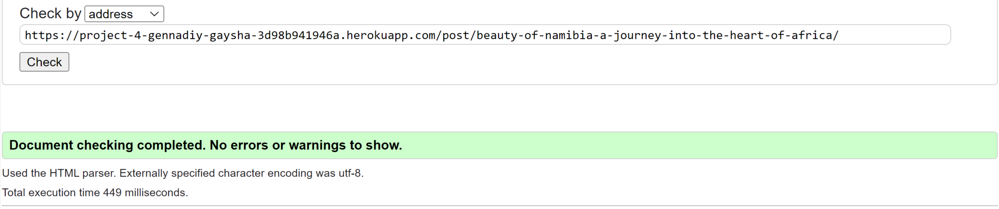
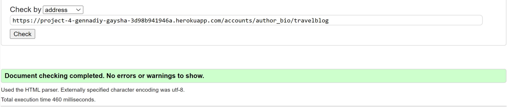
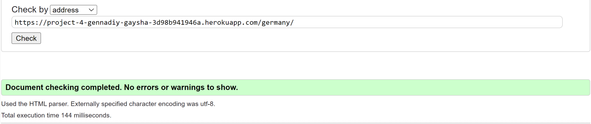

# TravelBlog Testing

[Back to the README.md file](README.md)

[View the live website here](https://project-4-gennadiy-gaysha-3d98b941946a.herokuapp.com/)

## Table of Contents

1. [Testing User Stories](#testing-user-stories)
    - [Epic: User Management](#epic-user-management)
    - [Epic: Post Management](#epic-post-management)
    - [Epic: Search and Filtering](#epic-search-and-filtering)
    - [Epic: Admin Management](#epic-admin-management)
    - [Epic: Error Handling](#epic-error-handling)
2. [Code Validation](#code-validation)
3. [Accessibility](#accessibility)
4. [Tools Testing](#tools-testing)
5. [Manual Testing](#manual-testing)

***

## Testing User Stories.

### Epic: User Management.

- As a **user** I can **register and create account** so that **I can access
  exclusive features and personalized content**

| No | Functionality                                                                                                                                                     | Result |
|----|-------------------------------------------------------------------------------------------------------------------------------------------------------------------|--------|
| 1  | The registration page includes fields for users to input their desired username, email address, and password.                                                     | passed |
| 2  | Upon successful registration, users receive a confirmation flash message.                                                                                         | passed |
| 3  | The system prevents users from registering with an email address already associated with an existing account.                                                     | passed |
| 4  | Passwords adhere to specific complexity requirements, including a minimum length and a mix of characters (uppercase, lowercase, numbers, and special characters). | passed |
| 5  | An error message is displayed if any required fields are left empty during the registration process.                                                              | passed |
| 6  | Upon successful registration, users are automatically redirected to the login page.                                                                               | passed |                                                                          | passed |

- As a **user** I can **log in and log out securely** so, that **my
  account remain protected and accessible only by me**

| No | Functionality                                                                                                                           | Result |
|----|-----------------------------------------------------------------------------------------------------------------------------------------|--------|
| 1  | Users can securely access a login page, providing their username and password.                                                          | passed |
| 2  | Upon successful login, users are automatically redirected to the home page.                                                             | passed |
| 3  | Users have the ability to securely log out of their accounts by clicking on the "Log Out" button.                                       | passed |
| 4  | Unauthorized attempts to access restricted pages result in automatic redirection to a warning page.                                     | passed |
| 5  | The login page effectively displays relevant error messages for invalid attempts, including incorrect credentials or inactive accounts. | passed |
| 6  | User sessions are securely managed and sustained, ensuring users remain logged in throughout their active browsing sessions.            | passed |

- As a **user** I can **change password** so that **I can maintain the security
  of my account and information.**

| No | Functionality                                                                                                                                        | Result |
|----|------------------------------------------------------------------------------------------------------------------------------------------------------|--------|
| 1  | Users can access the password change functionality directly from their profile settings.                                                             | passed |
| 2  | Upon choosing to change the password, users are presented with a form soliciting the current password and the desired new password.                  | passed |
| 3  | The system performs validation to ensure the new password meets specified security requirements, such as minimum length or specific character types. | passed |
| 4  | Upon successfully submitting the new password, users receive a confirmation flash message and are automatically redirected to the home page.         | passed |
| 5  | In case of any errors during the password change process, relevant error messages are displayed to guide users through the resolution.               | passed |

- As a **user** I can **create, update and personalize my profile after
  registration** so that **I can share my preferences and information with the
  community in a customized manner**

| No | Functionality                                                                                                                                                             | Result |
|----|---------------------------------------------------------------------------------------------------------------------------------------------------------------------------|--------|
| 1  | Upon registration, users gain access to a dedicated profile section.                                                                                                      | passed |
| 2  | Users can input information into various fields, including a photo, bio, date of birth, gender, home country, and links to social media profiles.                         | passed |
| 3  | The system validates that the required fields are correctly filled out and adheres to any specified formats, ensuring, for instance, valid dates and correct URL formats. | passed |
| 4  | Users retain the flexibility to update their profile information at any time post-registration.                                                                           | passed |
| 5  | Upon successfully saving changes, users receive a confirmation flash message indicating the successful update of their profile.                                           | passed |
| 6  | In the event of errors or validation issues, the system displays relevant error messages to guide users in making the necessary corrections.                              | passed |

- As a **user** I can **see other users' profiles** so that **I can connect and
  engage with other members of the community, fostering collaboration and
  interaction**

| No | Functionality                                                                                                                                                   | Result |
|----|-----------------------------------------------------------------------------------------------------------------------------------------------------------------|--------|
| 1  | Users have the capability to access a public profile page for every registered user who has written a post or a comment.                                        | passed |
| 2  | The profile page may exhibit fundamental user information, including the username, profile picture, and bio, contingent upon the details submitted by the user. | passed |
| 3  | Users are able to peruse posts authored by the profile owner directly on the profile page.                                                                      | passed |
| 4  | Users are restricted from altering information on profiles belonging to other users.                                                                            | passed |

 [Back to top ⇧](#table-of-contents)

### Epic: Post Management.

- As a **user** I can **view a paginated list of posts** so that **I can easily
  find and access various blog entries**

| No | Functionality                                                                                  | Result |
|----|------------------------------------------------------------------------------------------------|--------|
| 1  | Users can access a paginated list of posts on the site.                                        | passed |
| 2  | Each page exhibits a limited number of posts, facilitating smooth navigation.                  | passed |
| 3  | The posts are systematically organized for user convenience and efficient scanning.            | passed |
| 4  | Clicking on a post title from the list leads the user to a detailed view of the selected post. | passed |

- As a **user** I can **create new blog posts with text and images** so that *
  *I
  can share my experiences and insights with others**

| No | Functionality                                                                                                                                                                 | Result |
|----|-------------------------------------------------------------------------------------------------------------------------------------------------------------------------------|--------|
| 1  | Users can input and format text content for their blog posts, incorporating features like headings, paragraphs, lists, and standard text formatting.                          | passed |
| 2  | Users have the option to upload images to be included in their blog posts. The system supports various image formats and offers placement options within the text.            | passed |
| 3  | The system provides users with a preview of their blog post, allowing them to ensure that formatting and images appear as intended before publishing.                         | passed |
| 4  | The system automatically handles the resizing and optimization of uploaded images to ensure proper display on the blog without compromising page load speed.                  | passed |
| 5  | The blog editor features a user-friendly and intuitive interface, enabling users to create visually appealing and well-formatted posts without the need for HTML or CSS code. | passed |
| 6  | Users can save blog posts as drafts for later editing and publication.                                                                                                        | passed |

- As a **user** I can **edit and delete my own posts** so that **I have control
  over the content I publish and can keep it up to date**

| No | Functionality                                                                                                                                | Result |
|----|----------------------------------------------------------------------------------------------------------------------------------------------|--------|
| 1  | Users can save blog posts as drafts for later editing and publication, with the additional option to publish their posts for public viewing. | passed |
| 2  | After publication, users retain the ability to edit their posts for updates or delete them entirely if needed.                               | passed |

- As a **user** I can **like and comment on blog posts** so that **I can engage
  with the community, express my thoughts, and show appreciation for
  interesting
  content**

| No | Functionality                                                                                                                                     | Result |
|----|---------------------------------------------------------------------------------------------------------------------------------------------------|--------|
| 1  | Each blog post features a visible "Like" button, enabling users to express their appreciation for the content.                                    | passed |
| 2  | The "Like" button dynamically reflects the precise number of users who have liked the post, updating in real-time with user interactions.         | passed |
| 3  | Users can click the "Like" button only once per post, preventing duplicate likes from the same user.                                              | passed |
| 4  | The system allows users to unclick the "Like" button if they change their mind about their appreciation.                                          | passed |
| 5  | Users have the capability to leave comments on blog posts, utilizing a text field for their input.                                                | passed |
| 6  | Comments are linked to the respective blog post, displaying the user's name, comment content, and a timestamp indicating the posting time.        | passed |
| 7  | Basic moderation features are integrated, empowering administrators or authorized users to manage and remove inappropriate or offensive comments. | passed |

- As a **user** I can **open and read a post** so that **I could delve into the
  content and explore its details**

| No | Functionality                                                                                                               | Result |
|----|-----------------------------------------------------------------------------------------------------------------------------|--------|
| 1  | Users can access detailed views of individual posts from the list.                                                          | passed |
| 2  | The detailed view presents the complete content of the selected post.                                                       | passed |
| 3  | Each post includes a link to the author's profile page for further exploration of the author's contributions.               | passed |
| 4  | Each post contains a link to the respective country's profile page, providing users with additional contextual information. | passed |

- As a **user** I can **view the About Us page** so that **I can stay informed
  about the mission, and understand the platform's purpose and offerings**

| No | Functionality                                                                                                              | Result |
|----|----------------------------------------------------------------------------------------------------------------------------|--------|
| 1  | The About page prominently showcases the "title," "content," and "featured_image" for the website visitor.                 | passed |
| 2  | The displayed About information is well-formatted and responsive, ensuring optimal visibility across various screen sizes. | passed |

 [Back to top ⇧](#table-of-contents)

### Epic: Search and Filtering.

- As a **user** I can **utilize a system for categorizing and filtering posts
  by
  country** so that **I can easily navigate and explore content related to
  specific locations**

| No | Functionality                                                                                                                                                       | Result |
|----|---------------------------------------------------------------------------------------------------------------------------------------------------------------------|--------|
| 1  | Users can select a country from a dropdown menu while creating a new blog post.                                                                                     | passed |
| 2  | The chosen country or continent is associated with the post and stored in the database.                                                                             | passed |
| 3  | Posts are filterable based on the selected country, enabling users to view posts specific to a particular geographic location.                                      | passed |
| 4  | Each post prominently displays the associated country, facilitating easy identification of categorization.                                                          | passed |
| 5  | The interface for selecting countries is responsive and accessible across different devices, ensuring consistent usability on varying screen sizes.                 | passed |
| 6  | The categorization system seamlessly integrates with existing post creation, retrieval, and display functionalities, avoiding unexpected errors or inconsistencies. | passed |
| 7  | Users can modify the country or continent associated with a post after creation, providing flexibility in managing post categorization.                             | passed |

- As a **user** I can **quickly search and access brief information about a
  specific country** so that **I can gather essential details without extensive
  navigation or research**

| No | Functionality                                                                                                                                         | Result |
|----|-------------------------------------------------------------------------------------------------------------------------------------------------------|--------|
| 1  | The search functionality accepts user input, allowing them to enter the name of the desired country.                                                  | passed |
| 2  | The system displays concise and relevant information about the country, including basic facts such as its capital, population, and official language. | passed |
| 3  | Users can access the search feature from a prominent location within the platform, ensuring ease of use and accessibility.                            | passed |
| 4  | Search results provide accurate and up-to-date information obtained from reliable data sources.                                                       | passed |
| 5  | The search feature is responsive, providing a seamless experience across different devices and maintaining consistent usability.                      | passed |

- As a **user** I can **utilize a system for categorizing and filtering posts
  by
  author's name** so that **I can easily navigate and explore content related
  to
  specific author**

| No | Functionality                                                                                                                               | Result |
|----|---------------------------------------------------------------------------------------------------------------------------------------------|--------|
| 1  | The system enables users to select an author's name from a dropdown menu or input field when filtering posts.                               | passed |
| 2  | Posts are categorizable and filterable based on the selected author's name, allowing users to view posts specific to a particular author.   | passed |
| 3  | Each post prominently displays the author's name, providing users with a clear indication of the post's authorship.                         | passed |
| 4  | The interface for selecting authors is intuitive and responsive, ensuring a seamless user experience across different devices.              | passed |
| 5  | The system integrates smoothly with the existing post categorization and filtering functionalities, ensuring compatibility and ease of use. | passed |

 [Back to top ⇧](#table-of-contents)

### Epic: Admin Management.

- As a **site Admin** I can **monitor and manage user-generated content** so
  that **maintain a safe and high-quality platform**

| No | Functionality                                                                                                              | Result |
|----|----------------------------------------------------------------------------------------------------------------------------|--------|
| 1  | The admin panel provides tools for monitoring user-generated content, including posts, comments, and media uploads.        | passed |
| 2  | The content moderation tools allow the site Admin to publish, review, edit, or delete user-generated content as necessary. | passed |

- As a **site Admin** I can **manage user accounts** so that **I could ensure
  platform integrity and user compliance**

| No | Functionality                                                                                                                                      | Result |
|----|----------------------------------------------------------------------------------------------------------------------------------------------------|--------|
| 1  | Administrative controls encompass user account management functionalities, enabling tasks like user registration or deletion.                      | passed |
| 2  | The site Admin has oversight and management capabilities for user activities, including post and personal profile creation, editing, and deletion. | passed |
| 3  | The system ensures a secure and reliable authentication process for user access and data protection.                                               | passed |

- As a **site admin** I can **create, read, update, make drafts and delete
  posts
  using admin panel** so that **I can manage my own blog content**

| No | Functionality                                                                                                                            | Result |
|----|------------------------------------------------------------------------------------------------------------------------------------------|--------|
| 1  | The admin panel offers options to create new blog posts, incorporating fields for title, content, and associated metadata.               | passed |
| 2  | The admin can view and read their own blog posts, including titles, content, publication status, and associated metadata.                | passed |
| 3  | The admin possesses the ability to update and edit the content of their own blog posts, encompassing text, images, and metadata.         | passed |
| 4  | The admin panel supports the creation and management of draft posts, enabling the admin to save posts for later editing and publication. | passed |
| 5  | The admin can delete their own blog posts from the platform, removing them from public view and the database.                            | passed |

- As a **site admin** I can **manage countries and comments within the platform
  ** so that **I could oversee user interactions and ensure a safe and engaging
  community environment**

| No | Functionality                                                                                                                                                                      | Result |
|----|------------------------------------------------------------------------------------------------------------------------------------------------------------------------------------|--------|
| 1  | The admin panel features options to create, update, and delete country entries, empowering the admin to maintain an updated and accurate list of countries.                        | passed |
| 2  | The admin can view and manage user comments, including the ability to delete inappropriate or offensive comments when necessary.                                                   | passed |
| 3  | The system provides tools for the admin to monitor and moderate user-generated content, ensuring that comments adhere to community guidelines and standards.                       | passed |
| 4  | The country management system supports the addition of new countries and the editing of existing country information, such as names, descriptions, and related data.               | passed |
| 5  | The comment management system displays comments with relevant metadata, such as timestamps, user information, and associated post details, for efficient moderation and oversight. | passed |

- As a **site admin** I can **manage and update the About Us page through
  an intuitive interface within the Django admin panel** so that **the
  travelblog mission, purpose, and latest information are accurately presented
  to the site visitors**

| No | Functionality                                                                                                           | Result |
|----|-------------------------------------------------------------------------------------------------------------------------|--------|
| 1  | The admin panel offers a user-friendly interface for efficiently managing About entries.                                | passed |
| 2  | In cases where the About Us page lacks a featured image, a default image is displayed for a cohesive visual experience. | passed |
| 3  | Admins can effortlessly add, edit, or delete About entries using the Django admin panel.                                | passed |
| 4  | The admin panel provides options for managing the "title," "content," and "featured_image" fields for each About entry. | passed |
| 5  | The admin interface is intuitive and user-friendly, ensuring admins can handle About entries with ease and efficiency.  | passed |

 [Back to top ⇧](#table-of-contents)

### Epic: Error Handling.

- As a **user** I can **see friendly error pages when something goes wrong on
  the site** so that **I can better understand and navigate issues that might
  occur**

| No | Functionality                                                                                                                                                 | Result |
|----|---------------------------------------------------------------------------------------------------------------------------------------------------------------|--------|
| 1  | The error pages should feature clear and user-friendly messages tailored to each error type.                                                                  | passed |
| 2  | In the event of issues such as permission denials or missing pages, the website should seamlessly present the specially crafted error pages.                  | passed |
| 3  | Error pages must offer valuable information and provide guidance to visitors on the appropriate course of action.                                             | passed |
| 4  | Verify that when an error occurs, the website correctly displays the corresponding special page, ensuring it is visually appealing and easily comprehensible. | passed |
| 5  | Error pages should maintain consistency with the overall style and design aesthetics of the website.                                                          | passed |
| 6  | Inclusion of helpful links or tips on error pages is crucial to assist visitors in navigating back to the main site or relevant sections.                     | passed |

 [Back to top ⇧](#table-of-contents)

## Code Validation.

### HTML

The [W3C Markup Validator](https://validator.w3.org/) service was utilized to
validate the HTML code of the project, ensuring the absence of syntax errors.
Given that pages requiring authorization are not retrievable, the validation
was
conducted solely on templates accessible without authorization. All identified
errors in the developer code have been fixed. Please refer to the list of
screenshots below for further details.

- Home page:
   `https://project-4-gennadiy-gaysha-3d98b941946a.herokuapp.com/`
  

- Post Details page:
   `https://project-4-gennadiy-gaysha-3d98b941946a.herokuapp.com/post/beauty-of-namibia-a-journey-into-the-heart-of-africa/`
  

- Author Bio page:
   `https://project-4-gennadiy-gaysha-3d98b941946a.herokuapp.com/account/author_bio/travelblog`
  

- Show Country page:
   `https://project-4-gennadiy-gaysha-3d98b941946a.herokuapp.com/germany/`
  

- About page:
   `https://project-4-gennadiy-gaysha-3d98b941946a.herokuapp.com/about/`
  

- Login page:
   `https://project-4-gennadiy-gaysha-3d98b941946a.herokuapp.com/account/login/`
  

- Register page:
   `https://project-4-gennadiy-gaysha-3d98b941946a.herokuapp.com/account/register/`
  

### CSS

The W3C CSS Validator
[W3C CSS Validator](https://jigsaw.w3.org/css-validator/) service was employed
to validate the CSS code of the project, ensuring the absence of syntax errors.
W3C CSS Validator identified no errors or warnings in project's CSS file.

### PEP8

All Python files in the `travelblog directory` and the `travelblog app` have
been passed through the 
[Code Institute PEP8 Linter](https://pep8ci.herokuapp.com/). All errors were 
fixed, and the message "Results: All clear, no errors found" was obtained for 
all files.

