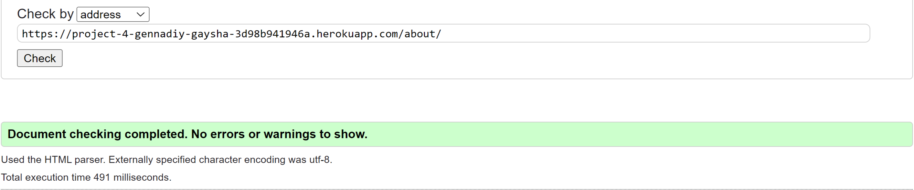

# TravelBlog Testing

[Back to the README.md file](README.md)

[View the live website here](https://project-4-gennadiy-gaysha-3d98b941946a.herokuapp.com/)

## Table of Contents

1. [Testing User Stories](#testing-user-stories)
    - [Epic: User Management](#epic-user-management)
    - [Epic: Post Management](#epic-post-management)
    - [Epic: Search and Filtering](#epic-search-and-filtering)
    - [Epic: Admin Management](#epic-admin-management)
    - [Epic: Error Handling](#epic-error-handling)
2. [Code Validation](#code-validation)
    - [HTML](#html)
    - [CSS](#css)
    - [Python](#python)
    - [JavaScript](#javascript)
3. [Accessibility](#accessibility)
4. [Tools Testing](#tools-testing)
5. [Manual Testing](#manual-testing)
    1. [Browser Compatibility](#browser-compatibility)
    2. [Testing Style And Functionality](#testing-style-and-functionality)

    - [Navigation bar](#navigation-bar)
    - [Search Country field](#search-country-field)
    - [Footer](#footer)
    - [Home page](#home-page)
    - [Post Details page](#post-details-page)
    - [User Profile page](#user-profile-page)
    - [Country page](#country-page)
    - [Create New Post page](#create-new-post-page)
    - [Update Post page](#update-post-page)
    - [Register page](#register-page)
    - [Create Profile page](#create-profile-page)
    - [Update Profile page](#update-profile-page)
    - [Edit details page](#edit-details-page)
    - [Change Password page](#change-password-page)
    - [Login page](#login-page)
    - [About page](#about-page)
    - [Post Deletion page](#post-deletion-page)
    - [Error And Warning pages](#error-and-warning-pages)

***

## Testing User Stories.

### Epic: User Management.

- As a **user** I can **register and create account** so that **I can access
  exclusive features and personalized content**

| No | Functionality                                                                                                                                                     | Result |
|----|-------------------------------------------------------------------------------------------------------------------------------------------------------------------|--------|
| 1  | The registration page includes fields for users to input their desired username, email address, and password.                                                     | passed |
| 2  | Upon successful registration, users receive a confirmation flash message.                                                                                         | passed |
| 3  | The system prevents users from registering with an email address already associated with an existing account.                                                     | passed |
| 4  | Passwords adhere to specific complexity requirements, including a minimum length and a mix of characters (uppercase, lowercase, numbers, and special characters). | passed |
| 5  | An error message is displayed if any required fields are left empty during the registration process.                                                              | passed |
| 6  | Upon successful registration, users are automatically redirected to the login page.                                                                               | passed |                                                                          | passed |

- As a **user** I can **log in and log out securely** so, that **my
  account remain protected and accessible only by me**

| No | Functionality                                                                                                                           | Result |
|----|-----------------------------------------------------------------------------------------------------------------------------------------|--------|
| 1  | Users can securely access a login page, providing their username and password.                                                          | passed |
| 2  | Upon successful login, users are automatically redirected to the home page.                                                             | passed |
| 3  | Users have the ability to securely log out of their accounts by clicking on the "Log Out" button.                                       | passed |
| 4  | Unauthorized attempts to access restricted pages result in automatic redirection to a warning page.                                     | passed |
| 5  | The login page effectively displays relevant error messages for invalid attempts, including incorrect credentials or inactive accounts. | passed |
| 6  | User sessions are securely managed and sustained, ensuring users remain logged in throughout their active browsing sessions.            | passed |

- As a **user** I can **change password** so that **I can maintain the security
  of my account and information.**

| No | Functionality                                                                                                                                        | Result |
|----|------------------------------------------------------------------------------------------------------------------------------------------------------|--------|
| 1  | Users can access the password change functionality directly from their profile settings.                                                             | passed |
| 2  | Upon choosing to change the password, users are presented with a form soliciting the current password and the desired new password.                  | passed |
| 3  | The system performs validation to ensure the new password meets specified security requirements, such as minimum length or specific character types. | passed |
| 4  | Upon successfully submitting the new password, users receive a confirmation flash message and are automatically redirected to the home page.         | passed |
| 5  | In case of any errors during the password change process, relevant error messages are displayed to guide users through the resolution.               | passed |

- As a **user** I can **create, update and personalize my profile after
  registration** so that **I can share my preferences and information with the
  community in a customized manner**

| No | Functionality                                                                                                                                                             | Result |
|----|---------------------------------------------------------------------------------------------------------------------------------------------------------------------------|--------|
| 1  | Upon registration, users gain access to a dedicated profile section.                                                                                                      | passed |
| 2  | Users can input information into various fields, including a photo, bio, date of birth, gender, home country, and links to social media profiles.                         | passed |
| 3  | The system validates that the required fields are correctly filled out and adheres to any specified formats, ensuring, for instance, valid dates and correct URL formats. | passed |
| 4  | Users retain the flexibility to update their profile information at any time post-registration.                                                                           | passed |
| 5  | Upon successfully saving changes, users receive a confirmation flash message indicating the successful update of their profile.                                           | passed |
| 6  | In the event of errors or validation issues, the system displays relevant error messages to guide users in making the necessary corrections.                              | passed |

- As a **user** I can **see other users' profiles** so that **I can connect and
  engage with other members of the community, fostering collaboration and
  interaction**

| No | Functionality                                                                                                                                                   | Result |
|----|-----------------------------------------------------------------------------------------------------------------------------------------------------------------|--------|
| 1  | Users have the capability to access a public profile page for every registered user who has written a post or a comment.                                        | passed |
| 2  | The profile page may exhibit fundamental user information, including the username, profile picture, and bio, contingent upon the details submitted by the user. | passed |
| 3  | Users are able to peruse posts authored by the profile owner directly on the profile page.                                                                      | passed |
| 4  | Users are restricted from altering information on profiles belonging to other users.                                                                            | passed |

[Back to top ⇧](#table-of-contents)

### Epic: Post Management.

- As a **user** I can **view a paginated list of posts** so that **I can easily
  find and access various blog entries**

| No | Functionality                                                                                  | Result |
|----|------------------------------------------------------------------------------------------------|--------|
| 1  | Users can access a paginated list of posts on the site.                                        | passed |
| 2  | Each page exhibits a limited number of posts, facilitating smooth navigation.                  | passed |
| 3  | The posts are systematically organized for user convenience and efficient scanning.            | passed |
| 4  | Clicking on a post title from the list leads the user to a detailed view of the selected post. | passed |

- As a **user** I can **create new blog posts with text and images** so that *
  *I
  can share my experiences and insights with others**

| No | Functionality                                                                                                                                                                 | Result |
|----|-------------------------------------------------------------------------------------------------------------------------------------------------------------------------------|--------|
| 1  | Users can input and format text content for their blog posts, incorporating features like headings, paragraphs, lists, and standard text formatting.                          | passed |
| 2  | Users have the option to upload images to be included in their blog posts. The system supports various image formats and offers placement options within the text.            | passed |
| 3  | The system provides users with a preview of their blog post, allowing them to ensure that formatting and images appear as intended before publishing.                         | passed |
| 4  | The system automatically handles the resizing and optimization of uploaded images to ensure proper display on the blog without compromising page load speed.                  | passed |
| 5  | The blog editor features a user-friendly and intuitive interface, enabling users to create visually appealing and well-formatted posts without the need for HTML or CSS code. | passed |
| 6  | Users can save blog posts as drafts for later editing and publication.                                                                                                        | passed |

- As a **user** I can **edit and delete my own posts** so that **I have control
  over the content I publish and can keep it up to date**

| No | Functionality                                                                                                                                | Result |
|----|----------------------------------------------------------------------------------------------------------------------------------------------|--------|
| 1  | Users can save blog posts as drafts for later editing and publication, with the additional option to publish their posts for public viewing. | passed |
| 2  | After publication, users retain the ability to edit their posts for updates or delete them entirely if needed.                               | passed |

- As a **user** I can **like and comment on blog posts** so that **I can engage
  with the community, express my thoughts, and show appreciation for
  interesting
  content**

| No | Functionality                                                                                                                                     | Result |
|----|---------------------------------------------------------------------------------------------------------------------------------------------------|--------|
| 1  | Each blog post features a visible "Like" button, enabling users to express their appreciation for the content.                                    | passed |
| 2  | The "Like" button dynamically reflects the precise number of users who have liked the post, updating in real-time with user interactions.         | passed |
| 3  | Users can click the "Like" button only once per post, preventing duplicate likes from the same user.                                              | passed |
| 4  | The system allows users to unclick the "Like" button if they change their mind about their appreciation.                                          | passed |
| 5  | Users have the capability to leave comments on blog posts, utilizing a text field for their input.                                                | passed |
| 6  | Comments are linked to the respective blog post, displaying the user's name, comment content, and a timestamp indicating the posting time.        | passed |
| 7  | Basic moderation features are integrated, empowering administrators or authorized users to manage and remove inappropriate or offensive comments. | passed |

- As a **user** I can **open and read a post** so that **I could delve into the
  content and explore its details**

| No | Functionality                                                                                                               | Result |
|----|-----------------------------------------------------------------------------------------------------------------------------|--------|
| 1  | Users can access detailed views of individual posts from the list.                                                          | passed |
| 2  | The detailed view presents the complete content of the selected post.                                                       | passed |
| 3  | Each post includes a link to the author's profile page for further exploration of the author's contributions.               | passed |
| 4  | Each post contains a link to the respective country's profile page, providing users with additional contextual information. | passed |

- As a **user** I can **view the About Us page** so that **I can stay informed
  about the mission, and understand the platform's purpose and offerings**

| No | Functionality                                                                                                              | Result |
|----|----------------------------------------------------------------------------------------------------------------------------|--------|
| 1  | The About page prominently showcases the "title," "content," and "featured_image" for the website visitor.                 | passed |
| 2  | The displayed About information is well-formatted and responsive, ensuring optimal visibility across various screen sizes. | passed |

[Back to top ⇧](#table-of-contents)

### Epic: Search and Filtering.

- As a **user** I can **utilize a system for categorizing and filtering posts
  by
  country** so that **I can easily navigate and explore content related to
  specific locations**

| No | Functionality                                                                                                                                                       | Result |
|----|---------------------------------------------------------------------------------------------------------------------------------------------------------------------|--------|
| 1  | Users can select a country from a dropdown menu while creating a new blog post.                                                                                     | passed |
| 2  | The chosen country or continent is associated with the post and stored in the database.                                                                             | passed |
| 3  | Posts are filterable based on the selected country, enabling users to view posts specific to a particular geographic location.                                      | passed |
| 4  | Each post prominently displays the associated country, facilitating easy identification of categorization.                                                          | passed |
| 5  | The interface for selecting countries is responsive and accessible across different devices, ensuring consistent usability on varying screen sizes.                 | passed |
| 6  | The categorization system seamlessly integrates with existing post creation, retrieval, and display functionalities, avoiding unexpected errors or inconsistencies. | passed |
| 7  | Users can modify the country or continent associated with a post after creation, providing flexibility in managing post categorization.                             | passed |

- As a **user** I can **quickly search and access brief information about a
  specific country** so that **I can gather essential details without extensive
  navigation or research**

| No | Functionality                                                                                                                                         | Result |
|----|-------------------------------------------------------------------------------------------------------------------------------------------------------|--------|
| 1  | The search functionality accepts user input, allowing them to enter the name of the desired country.                                                  | passed |
| 2  | The system displays concise and relevant information about the country, including basic facts such as its capital, population, and official language. | passed |
| 3  | Users can access the search feature from a prominent location within the platform, ensuring ease of use and accessibility.                            | passed |
| 4  | Search results provide accurate and up-to-date information obtained from reliable data sources.                                                       | passed |
| 5  | The search feature is responsive, providing a seamless experience across different devices and maintaining consistent usability.                      | passed |

- As a **user** I can **utilize a system for categorizing and filtering posts
  by
  author's name** so that **I can easily navigate and explore content related
  to
  specific author**

| No | Functionality                                                                                                                               | Result |
|----|---------------------------------------------------------------------------------------------------------------------------------------------|--------|
| 1  | The system enables users to select an author's name from a dropdown menu or input field when filtering posts.                               | passed |
| 2  | Posts are categorizable and filterable based on the selected author's name, allowing users to view posts specific to a particular author.   | passed |
| 3  | Each post prominently displays the author's name, providing users with a clear indication of the post's authorship.                         | passed |
| 4  | The interface for selecting authors is intuitive and responsive, ensuring a seamless user experience across different devices.              | passed |
| 5  | The system integrates smoothly with the existing post categorization and filtering functionalities, ensuring compatibility and ease of use. | passed |

[Back to top ⇧](#table-of-contents)

### Epic: Admin Management.

- As a **site Admin** I can **monitor and manage user-generated content** so
  that **maintain a safe and high-quality platform**

| No | Functionality                                                                                                              | Result |
|----|----------------------------------------------------------------------------------------------------------------------------|--------|
| 1  | The admin panel provides tools for monitoring user-generated content, including posts, comments, and media uploads.        | passed |
| 2  | The content moderation tools allow the site Admin to publish, review, edit, or delete user-generated content as necessary. | passed |

- As a **site Admin** I can **manage user accounts** so that **I could ensure
  platform integrity and user compliance**

| No | Functionality                                                                                                                                      | Result |
|----|----------------------------------------------------------------------------------------------------------------------------------------------------|--------|
| 1  | Administrative controls encompass user account management functionalities, enabling tasks like user registration or deletion.                      | passed |
| 2  | The site Admin has oversight and management capabilities for user activities, including post and personal profile creation, editing, and deletion. | passed |
| 3  | The system ensures a secure and reliable authentication process for user access and data protection.                                               | passed |

- As a **site admin** I can **create, read, update, make drafts and delete
  posts
  using admin panel** so that **I can manage my own blog content**

| No | Functionality                                                                                                                            | Result |
|----|------------------------------------------------------------------------------------------------------------------------------------------|--------|
| 1  | The admin panel offers options to create new blog posts, incorporating fields for title, content, and associated metadata.               | passed |
| 2  | The admin can view and read their own blog posts, including titles, content, publication status, and associated metadata.                | passed |
| 3  | The admin possesses the ability to update and edit the content of their own blog posts, encompassing text, images, and metadata.         | passed |
| 4  | The admin panel supports the creation and management of draft posts, enabling the admin to save posts for later editing and publication. | passed |
| 5  | The admin can delete their own blog posts from the platform, removing them from public view and the database.                            | passed |

- As a **site admin** I can **manage countries and comments within the platform
  ** so that **I could oversee user interactions and ensure a safe and engaging
  community environment**

| No | Functionality                                                                                                                                                                      | Result |
|----|------------------------------------------------------------------------------------------------------------------------------------------------------------------------------------|--------|
| 1  | The admin panel features options to create, update, and delete country entries, empowering the admin to maintain an updated and accurate list of countries.                        | passed |
| 2  | The admin can view and manage user comments, including the ability to delete inappropriate or offensive comments when necessary.                                                   | passed |
| 3  | The system provides tools for the admin to monitor and moderate user-generated content, ensuring that comments adhere to community guidelines and standards.                       | passed |
| 4  | The country management system supports the addition of new countries and the editing of existing country information, such as names, descriptions, and related data.               | passed |
| 5  | The comment management system displays comments with relevant metadata, such as timestamps, user information, and associated post details, for efficient moderation and oversight. | passed |

- As a **site admin** I can **manage and update the About Us page through
  an intuitive interface within the Django admin panel** so that **the
  travelblog mission, purpose, and latest information are accurately presented
  to the site visitors**

| No | Functionality                                                                                                           | Result |
|----|-------------------------------------------------------------------------------------------------------------------------|--------|
| 1  | The admin panel offers a user-friendly interface for efficiently managing About entries.                                | passed |
| 2  | In cases where the About Us page lacks a featured image, a default image is displayed for a cohesive visual experience. | passed |
| 3  | Admins can effortlessly add, edit, or delete About entries using the Django admin panel.                                | passed |
| 4  | The admin panel provides options for managing the "title," "content," and "featured_image" fields for each About entry. | passed |
| 5  | The admin interface is intuitive and user-friendly, ensuring admins can handle About entries with ease and efficiency.  | passed |

[Back to top ⇧](#table-of-contents)

### Epic: Error Handling.

- As a **user** I can **see friendly error pages when something goes wrong on
  the site** so that **I can better understand and navigate issues that might
  occur**

| No | Functionality                                                                                                                                                 | Result |
|----|---------------------------------------------------------------------------------------------------------------------------------------------------------------|--------|
| 1  | The error pages should feature clear and user-friendly messages tailored to each error type.                                                                  | passed |
| 2  | In the event of issues such as permission denials or missing pages, the website should seamlessly present the specially crafted error pages.                  | passed |
| 3  | Error pages must offer valuable information and provide guidance to visitors on the appropriate course of action.                                             | passed |
| 4  | Verify that when an error occurs, the website correctly displays the corresponding special page, ensuring it is visually appealing and easily comprehensible. | passed |
| 5  | Error pages should maintain consistency with the overall style and design aesthetics of the website.                                                          | passed |
| 6  | Inclusion of helpful links or tips on error pages is crucial to assist visitors in navigating back to the main site or relevant sections.                     | passed |

[Back to top ⇧](#table-of-contents)

## Code Validation.

### HTML.

The [W3C Markup Validator](https://validator.w3.org/) service was utilized to
validate the HTML code of the project, ensuring the absence of syntax errors.
Given that pages requiring authorization are not retrievable, the validation
was
conducted solely on templates accessible without authorization. All identified
errors in the developer code have been fixed. Please refer to the list of
screenshots below for further details.

- Home page:
   `https://project-4-gennadiy-gaysha-3d98b941946a.herokuapp.com/`
  

- Post Details page:
   `https://project-4-gennadiy-gaysha-3d98b941946a.herokuapp.com/post/beauty-of-namibia-a-journey-into-the-heart-of-africa/`
  

- Author Bio page:
   `https://project-4-gennadiy-gaysha-3d98b941946a.herokuapp.com/account/author_bio/travelblog`
  

- Show Country page:
   `https://project-4-gennadiy-gaysha-3d98b941946a.herokuapp.com/germany/`
  

- About page:
   `https://project-4-gennadiy-gaysha-3d98b941946a.herokuapp.com/about/`
  

- Login page:
   `https://project-4-gennadiy-gaysha-3d98b941946a.herokuapp.com/account/login/`
  

- Register page:
   `https://project-4-gennadiy-gaysha-3d98b941946a.herokuapp.com/account/register/`
  

### CSS.

The W3C CSS Validator
[W3C CSS Validator](https://jigsaw.w3.org/css-validator/) service was employed
to validate the CSS code of the project, ensuring the absence of syntax errors.
W3C CSS Validator identified no errors or warnings in project's CSS file.

### Python.

All Python files in the `travelblog directory` and the `travelblog app` have
been passed through the
[Code Institute PEP8 Linter](https://pep8ci.herokuapp.com/). All errors were
fixed, and the message "Results: All clear, no errors found" was obtained for
all files.

### JavaScript.

[JShint JavaScript Code Quality Tool](https://jshint.com/) was employed as
tool for assessing the quality of JavaScript code, to check the integrity of
the site's JavaScript implementation. The analysis revealed no errors in the
code.
[Back to top ⇧](#table-of-contents)

## Accessibility.

## Tools Testing.

### Chrome DevTools.

- [Chrome DevTools](https://developer.chrome.com/docs/devtools/) were used
  during the development process to test, explore, and modify HTML elements and
  CSS styles, while also looking for errors in the JS code.

### Responsiveness.

- [responsivedesignchecker.com](https://www.responsivedesignchecker.com/)
  was used to check responsiveness of the site pages across different devices.

## Manual Testing.

### Browser Compatibility.

- All site functions work correctly and the same in browsers that have
  different engines, i.e. Chrome, Firefox and Safari:

| Browser         | Outcome                                                                               | Pass/Fail |
|-----------------|---------------------------------------------------------------------------------------|-----------|
| Google Chrome   | No problems related to the appearance, responsiveness or functionality of the website | Pass      |
| Safari          | No problems related to the appearance, responsiveness or functionality of the website | Pass      |
| Mozilla Firefox | No problems related to the appearance, responsiveness or functionality of the website | Pass      |
| Microsoft Edge  | No problems related to the appearance, responsiveness or functionality of the website | Pass      |

### Testing Style And Functionality

#### Navigation bar

| Element                                        | Users                               | Test          | Outcome                                                                                                 | Pass/Fail |
|------------------------------------------------|-------------------------------------|---------------|---------------------------------------------------------------------------------------------------------|-----------|
| Main logo link                                 | All                                 | Functionality | Clicking the link redirects to the Home page.                                                           | Pass      |
|                                                |                                     | Style         | n/a                                                                                                     | n/a       |
| Register link                                  | Unauthorized                        | Functionality | Clicking the link redirects to the Register page.                                                       | Pass      |
|                                                |                                     | Style         | Hover effect working as expected.                                                                       | Pass      |
| Login link                                     | Unauthorized                        | Functionality | Clicking the link redirects to the Login page.                                                          | Pass      |
|                                                |                                     | Style         | Hover effect working as expected.                                                                       | Pass      |
| About link                                     | All                                 | Functionality | Clicking the link redirects to the About page.                                                          | Pass      |
|                                                |                                     | Style         | Hover effect working as expected.                                                                       | Pass      |
| Welcoming message                              | Unauthorized                        | Functionality | Impersonal greeting.                                                                                    | Pass      |
|                                                | Authorized                          |               | Personal greeting by username.                                                                          | Pass      |
| New post                                       | Authorized, created profile already | Functionality | Clicking the link redirects to the Create New Post page.                                                | Pass      |
|                                                |                                     | Style         | Hover effect working as expected.                                                                       | Pass      |
| New post                                       | Authorized, without profile         | Functionality | Clicking the link redirects to the Create User Profile First page.                                      |           |
|                                                |                                     | Style         | Hover effect working as expected.                                                                       |           |
| My posts                                       | Authorised as a post author         | Functionality | Clicking the drop-down item expands the dropdown menu.                                                  | Pass      |
|                                                |                                     | Style         | Hover effect working as expected.                                                                       | Pass      |
| My posts > Dropdown menu > Drafts              | Authorised as a post author         | Functionality | Clicking the link redirects to the paginated list of user’s Draft posts.                                | Pass      |
|                                                |                                     | Style         | Hover effect working as expected.                                                                       | Pass      |
| My posts > Dropdown menu > Awaiting moderation | Authorised as a post author         | Functionality | Clicking the link redirects to the paginated list of user’s Awaiting moderation posts.                  | Pass      |
|                                                |                                     | Style         | Hover effect working as expected.                                                                       | Pass      |
| My posts > Dropdown menu > Published           | Authorised as a post author         | Functionality | Clicking the link redirects to the paginated list of user’s Published posts.                            | Pass      |
|                                                |                                     | Style         | Hover effect working as expected.                                                                       | Pass      |
| My profile                                     | Authorized                          | Functionality | Clicking the drop-down item expands the dropdown menu.                                                  | Pass      |
|                                                |                                     | Style         | Hover effect working as expected.                                                                       | Pass      |
| My profile > Dropdown menu > Create profile    | Authorized, without profile         | Functionality | Clicking the link redirects to the Create Profile page.                                                 | Pass      |
|                                                |                                     | Style         | Hover effect working as expected.                                                                       | Pass      |
| My profile > Dropdown menu > Show profile      | Authorized, created profile already | Functionality | Clicking the link redirects to the Show Profile page.                                                   | Pass      |
|                                                |                                     | Style         | Hover effect working as expected.                                                                       | Pass      |
| My profile > Dropdown menu > Update profile    | Authorized, created profile already | Functionality | Clicking the link redirects to the Update Profile page.                                                 | Pass      |
|                                                |                                     | Style         | Hover effect working as expected.                                                                       | Pass      |
| My profile > Dropdown menu > Edit details      | Authorized                          | Functionality | Clicking the link redirects to the Edit Details page.                                                   | Pass      |
|                                                |                                     | Style         | Hover effect working as expected.                                                                       | Pass      |
| My profile > Dropdown menu > Change password   | Authorized                          | Functionality | Clicking the link redirects to the Change Password page.                                                | Pass      |
|                                                |                                     | Style         | Hover effect working as expected.                                                                       | Pass      |
| Logout link                                    | Authorized                          | Functionality | Clicking the link redirects to the Logout page. Flash message with confirmation of logout is displayed. | Pass      |
|                                                |                                     | Style         | Hover effect working as expected.                                                                       | Pass      |

[Back to top ⇧](#table-of-contents)

#### Search Country field

| Element       | Users | Test          | Outcome                                                                                                                  | Pass/Fail |
|---------------|-------|---------------|--------------------------------------------------------------------------------------------------------------------------|-----------|
| Input field   | All   | Functionality | Placeholder "Search country info" is shown as expected. Text can be entered into the field.                              | Pass      |
|               |       | Style         | Focus effect working as expected.                                                                                        | Pass      |
| Search button | All   | Functionality | Clicking the button redirects to the Search Results page. The input text is posted to the search results page correctly. | Pass      |
|               |       | Style         | Hover effect working as expected.                                                                                        | Pass      |

[Back to top ⇧](#table-of-contents)

#### Footer

| Element        | Users | Test          | Outcome                                                       | Pass/Fail |
|----------------|-------|---------------|---------------------------------------------------------------|-----------|
| Logo link      | All   | Functionality | Clicking the link redirects to the Home page.                 | Pass      |
|                |       | Style         | Hover effect working as expected.                             | Pass      |
| Facebook icon  | All   | Functionality | Clicking the link will open Facebook page on a separate tab.  | Pass      |
|                |       | Style         | Hover effect working as expected.                             | Pass      |
| Twitter icon   | All   | Functionality | Clicking the link will open Twitter page on a separate tab.   | Pass      |
|                |       | Style         | Hover effect working as expected.                             | Pass      |
| Instagram icon | All   | Functionality | Clicking the link will open Instagram page on a separate tab. | Pass      |
|                |       | Style         | Hover effect working as expected.                             | Pass      |
| LinkedIn icon  | All   | Functionality | Clicking the link open LinkedIn page on a separate tab.       | Pass      |
|                |       | Style         | Hover effect working as expected.                             | Pass      |

[Back to top ⇧](#table-of-contents)

#### Home page

| Element                        | Users | Test          | Outcome                                                                                                   | Pass/Fail |
|--------------------------------|-------|---------------|-----------------------------------------------------------------------------------------------------------|-----------|
| Dropdown select filter         | All   | Functionality | Clicking the drop-down item expands the list of countries to choose from.                                 | Pass      |
|                                |       | Style         | Hover effect working as expected.                                                                         | Pass      |
| Filter button                  | All   | Functionality | Clicking the button redirects to the page with a paginated list of filtered posts.                        | Pass      |
|                                |       | Style         | Hover effect working as expected.                                                                         | Pass      |
| Total number of posts sign     | All   | Functionality | Display the actual number of posts in the user's query.                                                   | Pass      |
|                                |       | Style         | Number of posts is highlighted as expected.                                                               | Pass      |
| Paginated list of posts        | All   | Functionality | Three posts per page are displayed as expected.                                                           | Pass      |
|                                |       | Style         | Styles apply to the list of post as expected.                                                             | Pass      |
| Pagination button              | All   | Functionality | Clicking the button redirects to the next paginated page.                                                 | Pass      |
|                                |       | Style         | Hover effect working as expected.                                                                         | Pass      |
| Post card > User name          | All   | Functionality | Clicking the button redirects to the Author Profile page.                                                 | Pass      |
|                                |       | Style         | Hover effect working as expected.                                                                         | Pass      |
| Post card > Country name       | All   | Functionality | Clicking the button redirects to the Country page.                                                        | Pass      |
|                                |       | Style         | Hover effect working as expected.                                                                         | Pass      |
| Post card > Title+excerpt      | All   | Functionality | Clicking the button redirects to the Post Details page. Post title and excerpt are truncated as expected. | Pass      |
|                                |       | Style         | Hover effect working as expected.                                                                         | Pass      |
| Post card > post creation date | All   | Functionality | n/a                                                                                                       | Pass      |
|                                |       | Style         | Hover effect working as expected.                                                                         | Pass      |

[Back to top ⇧](#table-of-contents)

#### Post Details page

| Element                                        | Users                                                                        | Test          | Outcome                                                                                                                                                                                     | Pass/Fail |
|------------------------------------------------|------------------------------------------------------------------------------|---------------|---------------------------------------------------------------------------------------------------------------------------------------------------------------------------------------------|-----------|
| Post head                                      | All                                                                          | Functionality | Post title and excerpt are truncated as expected.                                                                                                                                           | Pass      |
|                                                |                                                                              | Style         | All styles applied as expected.                                                                                                                                                             | Pass      |
| Post body                                      | All                                                                          | Functionality | Post body is displayed as expected.                                                                                                                                                         | Pass      |
|                                                |                                                                              | Style         | All styles applied as expected.                                                                                                                                                             | Pass      |
| Post head > User name                          | All                                                                          | Functionality | Clicking the link redirects to the Author Profile page.                                                                                                                                     | Pass      |
|                                                |                                                                              | Style         | Hover effect working as expected.                                                                                                                                                           | Pass      |
| Post head > Country name                       | All                                                                          | Functionality | Clicking the link redirects to the Country page.                                                                                                                                            | Pass      |
|                                                |                                                                              | Style         | Hover effect working as expected.                                                                                                                                                           | Pass      |
| Home button                                    | All                                                                          | Functionality | Clicking the button redirects to the Home page.                                                                                                                                             | Pass      |
|                                                |                                                                              | Style         | Hover effect working as expected.                                                                                                                                                           | Pass      |
| Update Post button                             | Authorized post author                                                       | Functionality | Clicking the button redirects to the Update Post page.                                                                                                                                      | Pass      |
|                                                |                                                                              | Style         | Hover effect working as expected.                                                                                                                                                           | Pass      |
| Delete Post button                             | Authorized post author                                                       | Functionality | Clicking the button redirects to the Deletion Warning page.                                                                                                                                 | Pass      |
|                                                |                                                                              | Style         | Hover effect working as expected.                                                                                                                                                           | Pass      |
| Like button                                    | Authorized, regardless of the post’s author                                  | Functionality | Clicking the button increases the number of likes by one if the user has not clicked it before. Clicking the button decreases the number of likes by one if the user has clicked it before. | Pass      |
|                                                |                                                                              | Style         | Hover effect working as expected.                                                                                                                                                           | Pass      |
| Comment icon                                   | All                                                                          | Functionality | A number of approved comments displayed correctly.                                                                                                                                          | Pass      |
|                                                |                                                                              | Style         | n/a                                                                                                                                                                                         | Pass      |
| Leave comments section > Leave a comment field | Authorized, that have created their profile  regardless of the post’s author | Functionality | Placeholder "Please leave your comment here" is shown as expected. Text can be entered into the field.                                                                                      | Pass      |
|                                                |                                                                              | Style         | Hover effect working as expected.                                                                                                                                                           | Pass      |
| Leave comments section > Submit button         | Authorized, that have created their profile  regardless of the post’s author | Functionality | Clicking the button submits the post for approval. Flash message with confirmation of submission is displayed.                                                                              | Pass      |
|                                                |                                                                              | Style         | Hover effect working as expected.                                                                                                                                                           | Pass      |
| Comments section > commentor name              | All                                                                          | Functionality | Clicking the link redirects to the Commentor’s Profile page.                                                                                                                                | Pass      |
|                                                |                                                                              | Style         | Hover effect working as expected.                                                                                                                                                           | Pass      |

[Back to top ⇧](#table-of-contents)

#### User Profile page

| Element                 | Users                             | Test          | Outcome                                                                                                                                                         | Pass/Fail |
|-------------------------|-----------------------------------|---------------|-----------------------------------------------------------------------------------------------------------------------------------------------------------------|-----------|
| Image                   | All                               | Functionality | Default image, depending on user’s gender displayed correctly. Uploaded image displayed correctly.                                                              | Pass      |
|                         |                                   | Style         | Image width is equal for all users’ profiles.                                                                                                                   | Pass      |
| Profile data            | All                               | Functionality | All user’s data rendered correctly.                                                                                                                             | Pass      |
|                         |                                   | Style         | All user’s data are capitalized.                                                                                                                                | Pass      |
| Follow me links         | All                               | Functionality | If the user has at least one social account, a sign ‘Follow me’ with the link to their social account is displayed.                                             | Pass      |
|                         |                                   | Style         | All user’s data are capitalized.                                                                                                                                | Pass      |
| List of published posts | All                               | Functionality | A list of the user's published posts, along with the country described and the creation date is displayed. The post title is the link to the Post Details page. | Pass      |
|                         |                                   | Style         | Hover effect working as expected.                                                                                                                               | Pass      |
| Update Profile button   | Authorised users on their profile | Functionality | Clicking the button redirects to the update User Profile (author_bio) page.                                                                                     | Pass      |
|                         |                                   | Style         | Hover effect working as expected.                                                                                                                               | Pass      |

[Back to top ⇧](#table-of-contents)

#### Country page

| Element              | Users | Test          | Outcome                                                                                                          | Pass/Fail |
|----------------------|-------|---------------|------------------------------------------------------------------------------------------------------------------|-----------|
| Flag Image           | All   | Functionality | Flag image corresponds to the country profile.                                                                   | Pass      |
|                      |       | Style         | Flag image width is equal for all countries.                                                                     | Pass      |
| Country Google map   | All   | Functionality | Country map corresponds to the country profile. The marker corresponds to the capital of the respective country. | Pass      |
|                      |       | Style         | Scale is the same for all maps of countries.                                                                     | Pass      |
| Country data         | All   | Functionality | All country data corresponds to the country profile.                                                             | Pass      |
|                      |       | Style         | Styles applied as expected.                                                                                      | Pass      |
| Wikipedia logo image | All   | Functionality | Clicking the image (link) redirects to the respective Wikipedia page for country profile.                        | Pass      |
|                      |       | Style         | Styles applied as expected.                                                                                      | Pass      |

[Back to top ⇧](#table-of-contents)

#### Create New Post page

| Element                           | Users                                       | Test          | Outcome                                                                                                                                                     | Pass/Fail |
|-----------------------------------|---------------------------------------------|---------------|-------------------------------------------------------------------------------------------------------------------------------------------------------------|-----------|
| Country dropdown list             | Authorized, that have created their profile | Functionality | Clicking the dropdown button makes a list of countries to choose from appear.                                                                               | Pass      |
|                                   |                                             | Functionality | Validation occurs, highlighting the field, if it is left empty.                                                                                             | Pass      |
|                                   |                                             | Style         | By hovering over the dropdown button, a floating hint appears.                                                                                              | Pass      |
| Title input                       | Authorized, that have created their profile | Functionality | Text can be entered into the field.                                                                                                                         | Pass      |
|                                   |                                             | Functionality | Validation occurs, highlighting the field, if it is left empty.                                                                                             | Pass      |
|                                   |                                             | Style         | Focus effect working as expected.                                                                                                                           | Pass      |
| Upload image (Choose file) button | Authorized, that have created their profile | Functionality | Clicking the button allows the user to upload their own main post image. Otherwise a default main post image will be applied.                               | Pass      |
|                                   |                                             | Style         | Hover effect working as expected.                                                                                                                           | Pass      |
| Excerpt input                     | Authorized, that have created their profile | Functionality | Text can be entered into the field. Optional field, allowed to be left empty.                                                                               | Pass      |
|                                   |                                             | Style         | Focus effect working as expected.                                                                                                                           | Pass      |
| Content input                     | Authorized, that have created their profile | Functionality | Summernote editor displayed correctly.  Text can be entered into the field.                                                                                 | Pass      |
|                                   |                                             | Functionality | Validation occurs (flash message & warning message) if the field is left empty.                                                                             | Pass      |
|                                   |                                             | Style         | Focus effect working as expected. Styled correctly by Summernote CSS code.                                                                                  | Pass      |
| Status dropdown list              | Authorized, that have created their profile | Functionality | Clicking the dropdown button makes a list of two statuses appear: “Save as draft” and “Send to moderation”.                                                 | Pass      |
|                                   |                                             | Style         | Hovering over the dropdown button makes a floating hint appear.                                                                                             | Fail      |
| Create post button                | Authorized, that have created their profile | Functionality | Clicking the button redirects to the Post Details page. A flash message about the successful creation of the post and its submission for moderation occurs. | Pass      |
|                                   |                                             | Style         | Hovering over the dropdown button makes a floating hint appear.                                                                                             | Pass      |

[Back to top ⇧](#table-of-contents)

#### Update Post page

| Element                           | Users                       | Test          | Outcome                                                                                                                                                                            | Pass/Fail |
|-----------------------------------|-----------------------------|---------------|------------------------------------------------------------------------------------------------------------------------------------------------------------------------------------|-----------|
| Country dropdown list             | Authorised                  | Functionality | The option in the field is being pre-populated correctly. The option can be edited.                                                                                                | Pass      |
|                                   |                             | Functionality | Validation occurs, highlighting the field, if it is left empty.                                                                                                                    | Pass      |
|                                   |                             | Style         | Hovering over the dropdown button makes a floating hint appear.                                                                                                                    | Pass      |
| Title input                       | Authorised as a post author | Functionality | The text in the field is being pre-populated correctly. The text can be edited.                                                                                                    | Pass      |
|                                   |                             | Functionality | Validation occurs, highlighting the field, if it is left empty.                                                                                                                    | Pass      |
|                                   |                             | Style         | Focus effect working as expected.                                                                                                                                                  | Pass      |
| Upload image (Choose file) button | Authorised as a post author | Functionality | Clicking the button allows the user to upload another main post image. If no image is chosen again, the default main post image will be applied.                                   | Pass      |
|                                   |                             | Style         | Hover effect working as expected.                                                                                                                                                  | Pass      |
| Excerpt input                     | Authorised as a post author | Functionality | Text can be entered into the field.  Optional field, allowed to be left empty.                                                                                                     | Pass      |
|                                   |                             | Style         | Focus effect working as expected.                                                                                                                                                  | Pass      |
| Content input                     | Authorised as a post author | Functionality | Summernote editor displayed correctly. The text in the field is being pre-populated correctly.  The text can be edited.                                                            | Pass      |
|                                   |                             | Functionality | Validation occurs (flash message & warning message) if the field is left empty.                                                                                                    | Pass      |
|                                   |                             | Style         | Focus effect working as expected. Styled correctly by Summernote CSS code.                                                                                                         | Pass      |
| Status dropdown list              | Authorised as a post author | Functionality | “Save as draft” option by default. By clicking on this form field, a list of two statuses to choose from appears: 'Save as draft' and 'Send to moderation'. Status can be changed. | Pass      |
|                                   |                             | Style         | Hovering over the dropdown button makes a floating hint appear.                                                                                                                    | Fail      |
| Create post button                | Authorised as a post author | Functionality | Clicking the button redirects to the Post Details page. A flash message about the successful editing of the post and its submission for moderation occurs.                         | Pass      |
|                                   |                             | Style         | Hover effect working as expected.                                                                                                                                                  | Pass      |
| Reject button                     | Authorised as a post author | Functionality | Clicking the button redirects to the Post Details page.                                                                                                                            | Pass      |
|                                   |                             | Style         | Hover effect working as expected.                                                                                                                                                  | Pass      |

[Back to top ⇧](#table-of-contents)

#### Register page

| Element          | Users        | Test          | Outcome                                                                                                                                                                                                               | Pass/Fail |
|------------------|--------------|---------------|-----------------------------------------------------------------------------------------------------------------------------------------------------------------------------------------------------------------------|-----------|
| Username input   | Unauthorised | Functionality | Text can be entered into the field. Not more than 20 symbols allowed. A sign beneath the field indicates that, once created, the username is uneditable.                                                              | Pass      |
|                  |              | Functionality | Validation occurs (highlighting the field plus pop-up info immage) if it is left empty or if an email is inputted in a format other than the correct one. Displays flash message if the username already exists.      | Pass      |
|                  |              | Style         | Focus effect working as expected.                                                                                                                                                                                     | Pass      |
| Email input      | Unauthorised | Functionality | Text in email format can be entered into a field.                                                                                                                                                                     | Pass      |
|                  |              | Functionality | Validation occurs (highlighted field & pop-up message) if the field is left empty. Displays flash message if the email already exists.                                                                                | Pass      |
|                  |              | Style         | Focus effect working as expected.                                                                                                                                                                                     | Pass      |
| First name input | Unauthorised | Functionality | Text can be entered into the field. Not more than 50 symbols allowed.                                                                                                                                                 | Pass      |
|                  |              | Functionality | Validation occurs (highlighted field & pop-up message) if the field is left empty.                                                                                                                                    | Pass      |
|                  |              | Style         | Focus effect working as expected.                                                                                                                                                                                     | Pass      |
| Last name input  | Unauthorised | Functionality | Text can be entered into the field. Not more than 50 symbols allowed.                                                                                                                                                 | Pass      |
|                  |              | Functionality | Validation occurs (highlighted field & pop-up message) if the field is left empty.                                                                                                                                    | Pass      |
|                  |              | Style         | Focus effect working as expected.                                                                                                                                                                                     | Pass      |
| Password         | Unauthorised | Functionality | Text can be entered into the field.                                                                                                                                                                                   | Pass      |
|                  |              | Functionality | Validation occurs (highlighted field & pop-up message) if the field is left empty. Validate input is a valid password.  Displays message if password is not valid.  Displays message if both passwords are not equal. | Pass      |
|                  |              | Style         | Focus effect working as expected.                                                                                                                                                                                     | Pass      |
| Register button  | Unauthorised | Functionality | Clicking the button redirects to the Login page. A flash message about the successful registration occurs.                                                                                                            | Pass      |
|                  |              | Style         | Hover effect working as expected.                                                                                                                                                                                     | Pass      |

[Back to top ⇧](#table-of-contents)

#### Create Profile page

| Element                           | Users                       | Test          | Outcome                                                                                                                                                                                                                                                                       | Pass/Fail |
|-----------------------------------|-----------------------------|---------------|-------------------------------------------------------------------------------------------------------------------------------------------------------------------------------------------------------------------------------------------------------------------------------|-----------|
| Upload image (Choose file) button | Authorised, without profile | Functionality | Clicking the button allows the user to upload their image. If no image is uploaded, the default user’s image, depending on user’s gender displayed.                                                                                                                           | Pass      |
|                                   |                             | Style         | Hover effect working as expected.                                                                                                                                                                                                                                             | Pass      |
| Bio input                         | Authorised, without profile | Functionality | Summernote editor displayed correctly.  Text can be entered into the field.                                                                                                                                                                                                   | Pass      |
|                                   |                             | Functionality | Validation occurs (highlighting the field plus pop-up info immage) if the field is left empty.                                                                                                                                                                                | Pass      |
|                                   |                             | Style         | Focus effect working as expected. Styled correctly by Summernote CSS code.                                                                                                                                                                                                    | Pass      |
| Home Country dropdown list        | Authorised, without profile | Functionality | Clicking the dropdown button makes a list of countries to choose from appear.                                                                                                                                                                                                 | Pass      |
|                                   |                             | Functionality | Validation occurs (highlighting the field plus pop-up info immage) if the field is left empty.                                                                                                                                                                                | Pass      |
|                                   |                             | Style         | By hovering over the dropdown button, a floating hint appears.                                                                                                                                                                                                                | Pass      |
| Gender dropdown list              | Authorised, without profile | Functionality | Clicking the dropdown button makes a list of genders to choose from appear.                                                                                                                                                                                                   | Pass      |
|                                   |                             | Functionality | Validation occurs (highlighting the field plus pop-up info immage) if the field is left empty.                                                                                                                                                                                | Pass      |
|                                   |                             | Style         | By hovering over the dropdown button, a floating hint appears.                                                                                                                                                                                                                | Pass      |
| Date of birth input               | Authorised, without profile | Functionality | Clicking on the field prompts a pop-up calendar to appear.  Selecting a date enters it into the field in the correct format. The date can be edited manually if needed. An optional field, allowed to be left empty; in this case, a ‘None’ value is rendered for this field. | Pass      |
|                                   |                             | Functionality | Validation occurs (flash message & warning message) if the date input has incorrect format.                                                                                                                                                                                   | Pass      |
|                                   |                             | Style         | Focus effect working as expected.                                                                                                                                                                                                                                             | Pass      |
| Input for social accounts' URLs   | Authorised, without profile | Functionality | URL can be entered into the field. An optional field, allowed to be left empty; in this case icon with link to that social account will not appear on the User Profile page.                                                                                                  | Pass      |
|                                   |                             | Functionality | Validation occurs (highlighting the field plus pop-up info immage) URL has incorrect format.                                                                                                                                                                                  | Pass      |
|                                   |                             | Style         | Focus effect working as expected.                                                                                                                                                                                                                                             | Pass      |
| Create Profile button             | Authorised, without profile | Functionality | Clicking the button redirects to the User Profile (author_bio) page. A flash message about the successful creation of the User Profile occurs.                                                                                                                                | Pass      |
|                                   |                             | Style         | Hover effect working as expected.                                                                                                                                                                                                                                             | Pass      |

[Back to top ⇧](#table-of-contents)

#### Update Profile page

| Element                           | Users      | Test          | Outcome                                                                                                                                                                                 | Pass/Fail |
|-----------------------------------|------------|---------------|-----------------------------------------------------------------------------------------------------------------------------------------------------------------------------------------|-----------|
| Upload image (Choose file) button | Authorised | Functionality | Clicking the button allows the user to upload their new image. If no image is uploaded again, the default user’s image, depending on user’s gender displayed.                           | Pass      |
|                                   |            | Style         | Hover effect working as expected.                                                                                                                                                       | Pass      |
| Bio input                         | Authorised | Functionality | Summernote editor displayed correctly.  The text in the field is being pre-populated correctly.   The text can be edited.                                                               | Pass      |
|                                   |            | Functionality | Validation occurs (highlighting the field plus pop-up info immage) if the field is left empty.                                                                                          | Pass      |
|                                   |            | Style         | Focus effect working as expected. Styled correctly by Summernote CSS code.                                                                                                              | Pass      |
| Home Country dropdown list        | Authorised | Functionality | The option in the field is being pre-populated correctly.  The option can be edited.                                                                                                    | Pass      |
|                                   |            | Functionality | Validation occurs (highlighting the field plus pop-up info immage) if the field is left empty.                                                                                          | Pass      |
|                                   |            | Style         | By hovering over the dropdown button, a floating hint appears.                                                                                                                          | Pass      |
| Gender dropdown list              | Authorised | Functionality | The option in the field is being pre-populated correctly.   The option can be edited.                                                                                                   | Pass      |
|                                   |            | Functionality | Validation occurs (highlighting the field plus pop-up info immage) if the field is left empty.                                                                                          | Pass      |
|                                   |            | Style         | By hovering over the dropdown button, a floating hint appears.                                                                                                                          | Pass      |
| Date of birth input               | Authorised | Functionality | The date in the field is being pre-populated correctly.   The date can be edited. An optional field, allowed to be left empty; in this case, a ‘None’ value is rendered for this field. | Pass      |
|                                   |            | Functionality | Validation occurs (flash message & warning message) if the edited date input has incorrect format.                                                                                      | Pass      |
|                                   |            | Style         | Focus effect working as expected.                                                                                                                                                       | Pass      |
| Input for social accounts' URLs   | Authorised | Functionality | The URL (if any) in the field is being pre-populated correctly.   The URL can be edited.                                                                                                | Pass      |
|                                   |            | Functionality | Validation occurs (highlighting the field plus pop-up info immage) edited URL has incorrect format.                                                                                     | Pass      |
|                                   |            | Style         | Focus effect working as expected.                                                                                                                                                       | Pass      |
| Update Profile button             | Authorised | Functionality | Clicking the button redirects to the updated User Profile (author_bio) page.                                                                                                            | Pass      |
|                                   |            | Style         | Hover effect working as expected.                                                                                                                                                       | Pass      |

[Back to top ⇧](#table-of-contents)

#### Edit details page

| Element          | Users      | Test          | Outcome                                                                                                                                                        | Pass/Fail |
|------------------|------------|---------------|----------------------------------------------------------------------------------------------------------------------------------------------------------------|-----------|
| Username input   | Authorised | Functionality | Text in the field is uneditable as expected.                                                                                                                   | Pass      |
|                  |            | Functionality | A sign beneath the field indicates that the field is uneditable.                                                                                               | n/a       |
|                  |            | Style         | The background of the field is grey to remind the user that the field is uneditable.                                                                           | n/a       |
| Email input      | Authorised | Functionality | The email in the field is being pre-populated correctly. The email can be edited.                                                                              | Pass      |
|                  |            | Functionality | Validation occurs (highlighted field & pop-up message) if the field is left empty or has incorrect format. Displays flash message if the email already exists. | Pass      |
|                  |            | Style         | Focus effect working as expected.                                                                                                                              | Pass      |
| First name input | Authorised | Functionality | The First Name in the field is being pre-populated correctly. First Name can be edited; not more than 50 symbols allowed.                                      | Pass      |
|                  |            | Functionality | Validation occurs (highlighted field & pop-up message) if the field is left empty.                                                                             | Pass      |
|                  |            | Style         | Focus effect working as expected.                                                                                                                              | Pass      |
| Last name input  | Authorised | Functionality | The Last Name in the field is being pre-populated correctly.  Last Name can be edited; not more than 50 symbols allowed.                                       | Pass      |
|                  |            | Functionality | Validation occurs (highlighted field & pop-up message) if the field is left empty.                                                                             | Pass      |
|                  |            | Style         | Focus effect working as expected.                                                                                                                              | Pass      |
| Submit button    | Authorised | Functionality | Clicking the button redirects to the Home page. A flash message about the successful editing of the details occurs.                                            | Pass      |
|                  |            | Style         | Hover effect working as expected.                                                                                                                              | Pass      |

[Back to top ⇧](#table-of-contents)

#### Change Password page

| Element                         | Users      | Test          | Outcome                                                                                                            | Pass/Fail |
|---------------------------------|------------|---------------|--------------------------------------------------------------------------------------------------------------------|-----------|
| Old password input              | Authorised | Functionality | Last Password can be entered into the field.                                                                       | Pass      |
|                                 |            | Functionality | Validation occurs (flash message & warning message) if the password entered is incorrect.                          | Pass      |
|                                 |            | Style         | Focus effect working as expected.                                                                                  | Pass      |
| New password input              | Authorised | Functionality | New Password can be entered into the field.                                                                        | Pass      |
|                                 |            | Functionality | Validation occurs (flash message & warning message) if two new password fields didn’t match.                       | Pass      |
|                                 |            | Style         | Focus effect working as expected.                                                                                  | Pass      |
| New password confirmation input | Authorised | Functionality | New Password confirmation can be entered into the field.                                                           | Pass      |
|                                 |            | Functionality | Validation occurs (flash message & warning message) if two new password fields didn’t match.                       | Pass      |
|                                 |            | Style         | Focus effect working as expected.                                                                                  | Pass      |
| Change password button          | Authorised | Functionality | Clicking the button redirects to the Home page. A flash message about the successful changing the password occurs. | Pass      |
|                                 |            | Style         | Hover effect working as expected.                                                                                  | Pass      |
| Reject button                   | Authorised | Functionality | Clicking the button redirects to the Home page.                                                                    | Pass      |
|                                 |            | Style         | Hover effect working as expected.                                                                                  | Pass      |

[Back to top ⇧](#table-of-contents)

#### Login page

| Element        | Users        | Test          | Outcome                                                                                                  | Pass/Fail |
|----------------|--------------|---------------|----------------------------------------------------------------------------------------------------------|-----------|
| Username input | Unauthorised | Functionality | Username can be entered into the field                                                                   | Pass      |
|                |              | Functionality | Validation occurs (warning message) if the username, password, or both are incorrect.                    | Pass      |
|                |              | Style         | Focus effect working as expected.                                                                        | Pass      |
| Password input | Unauthorised | Functionality | Password can be entered into the field.                                                                  | Pass      |
|                |              | Functionality | Validation occurs (warning message) if the username, password, or both are incorrect.                    | Pass      |
|                |              | Style         | Focus effect working as expected.                                                                        | Pass      |
| Login button   | Unauthorised | Functionality | Clicking the button redirects to the Home page. A flash message about the successful login is displayed. | Pass      |
|                |              | Style         | Hover effect working as expected.                                                                        | Pass      |

[Back to top ⇧](#table-of-contents)

#### About page

| Element     | Users | Test          | Outcome                           | Pass/Fail |
|-------------|-------|---------------|-----------------------------------|-----------|
| Page layout | All   | Functionality | The About page renders correctly. | Pass      |
|             |       | Style         | Style applied as expected.        | Pass      |

[Back to top ⇧](#table-of-contents)

#### Post Deletion page

| Element            | Users                       | Test          | Outcome                                                                                                           | Pass/Fail |
|--------------------|-----------------------------|---------------|-------------------------------------------------------------------------------------------------------------------|-----------|
| Page content       | Authorised as a post author | Functionality | A deletion warning sign is displayed.                                                                             | Pass      |
|                    |                             | Style         | Style applied as expected.                                                                                        | Fail      |
| Delete Post button | Authorised as a post author | Functionality | Clicking the button redirects to the Home page. A flash message about the successful deletion of the post occurs. | Pass      |
|                    |                             | Style         | Hover effect working as expected.                                                                                 | Pass      |
| Reject button      | Authorised as a post author | Functionality | Clicking the button redirects to the Post Details page.                                                           | Pass      |
|                    |                             | Style         | Hover effect working as expected.                                                                                 | Pass      |

[Back to top ⇧](#table-of-contents)

#### Error and Warning pages.

To test the triggering of custom Warning Pages or 403, 404 and 500 errors, a
link to the homepage was used as the base for constructing triggering links.
The link consists of the domain (herokuapp.com) and the subdomain name, which
is the project's name (i.e., 'project-4-gennadiy-gaysha-3d98b941946a'):

`https://project-4-gennadiy-gaysha-3d98b941946a.herokuapp.com`

The test was conducted by adding different URL patterns (endpoints) to the '
base' under different conditions. The table below presents the test results:

| Endpoint description                                     | URL pattern                        | Users                                                           | Triggering result         | Error status / message                    |
|----------------------------------------------------------|------------------------------------|-----------------------------------------------------------------|---------------------------|-------------------------------------------|
| Random set of symbols                                    | /nkjw6q3’#as/dF                    | All                                                             | Page not found            | 404                                       |
| Endpoint that does not exist (not from apps’ urls.py)    | /some_other_endpoint/              | All                                                             | Page not found            | 404                                       |
| Link to the Register page                                | /accounts/register/                | Authorized                                                      | Warning                   | You have already registered your account! |
| Link to the Edit Details page                            | /accounts/edit_details/            | Unauthorized                                                    | Internal Server Error     | 500                                       |
| Link to the Change Password page                         | /accounts/change_password/         | Unauthorized                                                    | redirecting to Login page | n/a                                       |
| Link to the Create Profile Page                          | /accounts/create_profile/username/ | Unauthorized, Authorized that have name another than ‘username’ | Access denied             | 403                                       |
| Link to the Create Profile Page                          | /accounts/create_profile/username/ | Authorized which name is the ‘username’                         | Warning                   | You have already created your profile!    |
| Link to the user’s Update Profile page                   | /accounts/update_profile/username/ | Unauthorized, Authorised regardless the user                    | Access denied             | 403                                       |
| Link to the user’s Update Profile page                   | /accounts/update_profile/username/ | Authorised user without profile                                 | Internal Server Error     | 500                                       |
| Create Post page                                         | /create_post/                      | Unauthorized                                                    | redirecting to Login page | n/a                                       |
| Create Post page                                         | /create_post/                      | Authorised user without profile                                 | Warning                   | Create your User profile first!           |
| Edit Post page                                           | /update_post/post.slug/            | Unauthorized, Authorised regardless the post author             | Access denied             | 403                                       |
| Link to the author’s ‘Draft’ list of posts               | /draft_list/username/              | Unauthorized                                                    | Access denied             | 403                                       |
| Link to the author’s ‘Awaiting moderation’ list of posts | /moderation_list/username/         | Unauthorized                                                    | Access denied             | 403                                       |
| Link to the author’s ‘Published’ list of posts           | /published_list/username/          | Unauthorized                                                    | Access denied             | 403                                       |

[Back to top ⇧](#table-of-contents)

